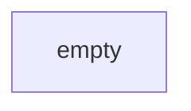

# Architecture — naver-blog-bot

> Append-only Decision Log. 결정 변경 시 새 ADR로 supersede (이전 항목 수정 X).
> 모듈 그래프는 review-strict가 변경 시 자동 갱신.

## Module Dependency Graph (live)

> 갱신 정책: 모듈 추가/삭제/의존성 변경 시 review-strict가 갱신.

## Data Flow

(미정의)

## Architecture Decision Records (Append-only)

번호는 자연수 순서. 한번 적힌 ADR은 수정하지 않음. 결정이 바뀌면 새 ADR을 추가하고
`Supersedes: ADR-NNN` 명시.

(부트스트랩 시 비어 있음)

<!-- ADR 형식:
### ADR-001: <제목>
- 날짜: YYYY-MM-DD
- 상태: Proposed | Accepted | Superseded by ADR-NNN | Deprecated
- 결정: <무엇>
- 이유: <왜>
- 대안: <고려한 옵션>
- 트레이드오프: <포기한 것>
-->
