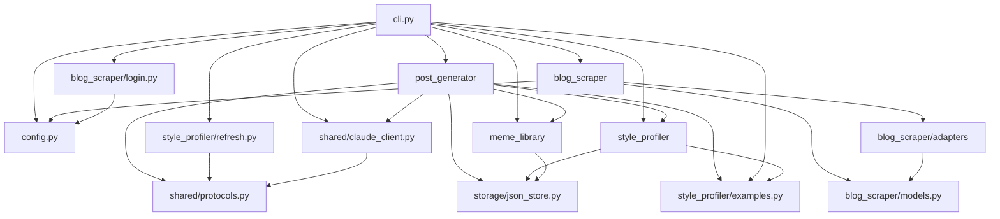

# Architecture — naver-blog-bot

> Append-only Decision Log. 결정 변경 시 새 ADR로 supersede (이전 항목 수정 X).
> 모듈 그래프는 review-strict가 변경 시 자동 갱신.

## Module Dependency Graph (live)

> 갱신 정책: 모듈 추가/삭제/의존성 변경 시 review-strict가 갱신.

## Data Flow

1. User runs `naver-bot draft <photo...> "메모"`.
2. `cli.py` loads `Settings` from `config.py`, ensures local directories exist, and validates that each photo path exists on disk.
3. `style_profiler.service` loads `config/style_profiles/<profile-name>.json` or returns an empty `StyleProfile` when the file is missing.
4. `meme_library.service` loads `config/meme_index.json` or returns an empty `MemeIndex`.
5. `post_generator.generator.PostGenerator` builds a prompt from memo, photo paths, style profile, meme index, and OGQ settings.
6. `shared.claude_client.build_text_completer()` selects a Claude backend. `claude-code` runs the local Claude Code CLI, while `anthropic-sdk` calls the Anthropic SDK with cacheable style/meme context blocks.
7. `post_generator.drafts.DraftRepository` writes the resulting draft to `drafts/<draft_id>.json`.
8. User runs `naver-bot preview <draft_id>` to inspect the local draft before any publishing cycle exists.

### profile-refresh data flow

1. User runs `naver-bot profile-refresh [--profile <name>] [--count <n>] <sample-file-or-url...>`.
2. `cli.py` loads `Settings`, ensures `config/style_profiles/` exists, validates profile name, and rejects non-positive `--count`.
3. Local sample files are read as UTF-8 text.
4. HTTP/HTTPS sources are routed through `blog_scraper.service.scrape()`. Naver and Tistory blog URLs collect recent post URLs up to `--count`; post URLs scrape a single post; generic URLs scrape the page as one post.
5. `blog_scraper` returns `PostDocument` blocks that preserve text, image, and emoticon order. URL samples are converted with `PostDocument.to_structured_text()` using `[이미지]` and `[이모티콘:설명]` markers.
6. `cli.py` injects `shared/claude_client.py` into `style_profiler/refresh.py`, which asks for `emoticon_usage_patterns` alongside writing-style fields.
7. Claude returns a JSON object; `refresh.py` validates and constructs `StyleProfile`.
8. `style_profiler/service.py` writes `config/style_profiles/<profile-name>.json`.

## Architecture Decision Records (Append-only)

번호는 자연수 순서. 한번 적힌 ADR은 수정하지 않음. 결정이 바뀌면 새 ADR을 추가하고
`Supersedes: ADR-NNN` 명시.

(부트스트랩 시 비어 있음)

### ADR-001: Foundation slice uses local JSON and injectable Claude client
- 날짜: 2026-05-03
- 상태: Accepted
- 결정: Phase 1 begins with a local Python CLI foundation that stores drafts, style profile, and meme index data as JSON files and routes all Claude API calls through `shared/claude_client.py`.
- 이유: The approved product is single-user and local-first, so JSON storage and an injectable Claude wrapper are sufficient for draft/preview work while keeping tests offline and preserving future Telegram reuse boundaries.
- 대안: Build Playwright publishing first; use a database from the start; call Anthropic directly from each module.
- 트레이드오프: Publishing and automated style/meme collection are not available in this slice, but the code gains testable boundaries before external-state automation is added.

### ADR-002: Named local style profiles replace single-file profile

- 날짜: 2026-05-05
- 상태: Accepted
- 결정: Style profiles are stored as `config/style_profiles/<name>.json` instead of a single `config/style_profile.json`. The `draft` command accepts `--profile <name>` (default: `default`).
- 이유: Multiple writing categories (food review, product review, travel) each need distinct style guidance; a single file cannot represent them simultaneously.
- 대안: Single file with an array of profiles; use blog categories as filenames.
- 트레이드오프: Existing `config/style_profile.json` is no longer read; users must run `profile-refresh` once to create a named profile.

### ADR-003: Style refresh uses structured public blog scraping

- 날짜: 2026-05-08
- 상태: Accepted
- 결정: `profile-refresh` accepts local files and HTTP/HTTPS sources. URL sources use a Playwright-backed `blog_scraper` service with Naver, Tistory, and generic adapters, preserving text/image/emoticon order as `PostDocument` blocks before converting them to structured sample text.
- 이유: Style learning needs the relative placement and frequency of text, images, and emoticons, not just copied text. Reusing `Settings.browser_profile_dir` also allows Naver pages that depend on the user's local browser session while still supporting public posts.
- 대안: Keep `profile-refresh` local-file-only; fetch pages with a simple HTTP client; store raw HTML as style samples.
- 트레이드오프: Playwright adds runtime dependency and browser setup cost, but it gives a shared path for dynamic blog pages and future session-aware scraping.

### ADR-004: Claude calls support selectable local backends

- 날짜: 2026-05-09
- 상태: Accepted
- 결정: Claude text completion is selected through `build_text_completer()`, with `auto`, `claude-code`, and `anthropic-sdk` backends. The default `auto` mode prefers the installed Claude Code CLI and falls back to the existing Anthropic SDK path when the CLI command is unavailable.
- 이유: The tool is local-first and the target user already runs Claude Code locally, so requiring a separate API key is unnecessary friction for the common path.
- 대안: Remove SDK support entirely; keep API-key-only generation; export prompts for manual copy/paste into Claude Code.
- 트레이드오프: Claude Code backend cannot use SDK prompt-cache block semantics and depends on local CLI availability/login state, but it removes API key setup for local users while keeping SDK fallback for automation.

### ADR-005: Headed manual login + mobile-home post-list endpoint

- 날짜: 2026-05-30
- 상태: Accepted
- 결정: (1) `naver-bot login`이 headed(headless=False) persistent Chromium을 `browser-profile/`로 띄워 사용자가 직접 네이버에 로그인하고 세션을 디스크에 저장한다. (2) `post_list_url`은 레거시 `PostList.naver` 대신 모바일 블로그 홈 `m.blog.naver.com/{blogId}`를 사용하고, `collect_blog_post_urls`는 live DOM 앵커를 폴링한다.
- 이유: probe 진단 결과 `PostList.naver`는 포스트 앵커 0개(비결정적), 모바일 홈은 로그아웃 상태로도 공개 글을 안정 렌더. 공개 글은 로그인 불필요하나 비공개·이웃공개 글과 세션 안정성을 위해 headed 수동 로그인을 제공한다. 자동 자격증명 입력은 CAPTCHA/2FA·ToS 위험으로 배제.
- 대안: PostList.naver 유지(실패); PC iframe(mainFrame) 파싱; headless 자동 로그인; API 키만 사용.
- 트레이드오프: WSLg 등 디스플레이가 필요하고 1회 수동 로그인 단계가 생기지만, 자동화 탐지·계정 위험을 피하고 공개·비공개 글 모두 학습 가능하게 한다.

### ADR-006: Category filtering via PostTitleListAsync JSON API

- 날짜: 2026-05-31
- 상태: Accepted
- 결정: `profile-refresh` URL에 `categoryNo`가 있으면 `collect_blog_post_urls`가 DOM 스크래핑 대신 `blog.naver.com/PostTitleListAsync.naver?blogId=&categoryNo=&countPerPage=30&currentPage=1` JSON API를 `page.evaluate(fetch)`로 호출해 해당 카테고리 글만 수집한다. categoryNo가 없으면 기존 모바일 홈 DOM 경로 유지.
- 이유: probe 진단 결과 모바일 홈·`PostList.naver`·PC iframe 모두 `categoryNo`를 무시하고 최근 글 전체를 반환(카테고리별 프로필이 같은 데이터로 학습되는 버그). `PostTitleListAsync.naver`만 카테고리를 정확히 필터(맛집=5, 연애=2 검증)하고 JSON `postList[].logNo`를 제공한다.
- 대안: PC iframe(mainFrame) 파싱(필터 안 됨); 모바일 category-list API(post-list는 403/CSRF); DOM 앵커 필터(불가).
- 트레이드오프: 비공개 JSON 엔드포인트에 의존하므로 네이버가 응답 형태를 바꾸면 깨질 수 있으나, 카테고리 필터를 실제로 지원하는 유일한 검증된 경로다. 본문은 기존 `scrape_post`가 그대로 처리.

<!-- ADR 형식:
### ADR-001: <제목>
- 날짜: YYYY-MM-DD
- 상태: Proposed | Accepted | Superseded by ADR-NNN | Deprecated
- 결정: <무엇>
- 이유: <왜>
- 대안: <고려한 옵션>
- 트레이드오프: <포기한 것>
-->
