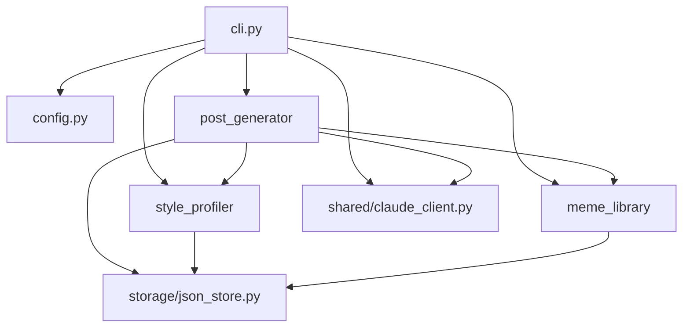

# Architecture — naver-blog-bot

> Append-only Decision Log. 결정 변경 시 새 ADR로 supersede (이전 항목 수정 X).
> 모듈 그래프는 review-strict가 변경 시 자동 갱신.

## Module Dependency Graph (live)

> 갱신 정책: 모듈 추가/삭제/의존성 변경 시 review-strict가 갱신.

## Data Flow

1. User runs `naver-bot draft <photo...> "메모"`.
2. `cli.py` loads `Settings` from `config.py`, ensures local directories exist, and validates that each photo path exists on disk.
3. `style_profiler.service` loads `config/style_profile.json` or returns an empty `StyleProfile`.
4. `meme_library.service` loads `config/meme_index.json` or returns an empty `MemeIndex`.
5. `post_generator.generator.PostGenerator` builds a prompt from memo, photo paths, style profile, meme index, and OGQ settings.
6. `shared.claude_client.ClaudeTextClient` calls the Anthropic SDK with cacheable style/meme context blocks.
7. `post_generator.drafts.DraftRepository` writes the resulting draft to `drafts/<draft_id>.json`.
8. User runs `naver-bot preview <draft_id>` to inspect the local draft before any publishing cycle exists.

## Architecture Decision Records (Append-only)

번호는 자연수 순서. 한번 적힌 ADR은 수정하지 않음. 결정이 바뀌면 새 ADR을 추가하고
`Supersedes: ADR-NNN` 명시.

(부트스트랩 시 비어 있음)

### ADR-001: Foundation slice uses local JSON and injectable Claude client
- 날짜: 2026-05-03
- 상태: Accepted
- 결정: Phase 1 begins with a local Python CLI foundation that stores drafts, style profile, and meme index data as JSON files and routes all Claude API calls through `shared/claude_client.py`.
- 이유: The approved product is single-user and local-first, so JSON storage and an injectable Claude wrapper are sufficient for draft/preview work while keeping tests offline and preserving future Telegram reuse boundaries.
- 대안: Build Playwright publishing first; use a database from the start; call Anthropic directly from each module.
- 트레이드오프: Publishing and automated style/meme collection are not available in this slice, but the code gains testable boundaries before external-state automation is added.

<!-- ADR 형식:
### ADR-001: <제목>
- 날짜: YYYY-MM-DD
- 상태: Proposed | Accepted | Superseded by ADR-NNN | Deprecated
- 결정: <무엇>
- 이유: <왜>
- 대안: <고려한 옵션>
- 트레이드오프: <포기한 것>
-->
