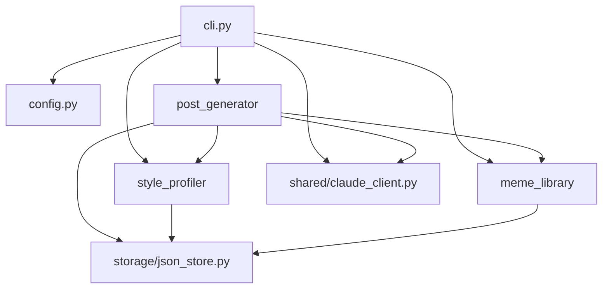

# Foundation Review Cleanup Implementation Plan

> **For agentic workers:** REQUIRED SUB-SKILL: Use superpowers:subagent-driven-development (recommended) or superpowers:executing-plans to implement this plan task-by-task. Steps use checkbox (`- [ ]`) syntax for tracking.

**Goal:** Align review-noted documentation and type hints after the Foundation slice without changing runtime behavior.

**Architecture:** This plan makes one narrow cleanup pass over existing foundation files. Documentation updates keep the AI context and project compass accurate; code updates only add type information and align an existing protocol with the existing Claude client signature.

**Tech Stack:** Python 3.11+, Typer, pydantic-settings, pytest, Markdown, Mermaid.

---

## Scope Check

The cleanup spec covers one cohesive follow-up: fix review-noted drift after the Foundation slice. It does not introduce a new subsystem and should be implemented as a single small plan.

---

## File Structure

- Modify: `CLAUDE.md`
  - Responsibility: project compass loaded into future sessions; module list must reflect live foundation modules.
- Modify: `docs/ai-context/architecture.md`
  - Responsibility: live dependency graph, data flow, and append-only architecture decisions.
- Modify: `src/naver_blog_bot/post_generator/generator.py`
  - Responsibility: draft generation service and type contracts around text completion/prompt construction.

No new files are required.

---

### Task 1: Documentation Drift Cleanup

**Files:**
- Modify: `CLAUDE.md`
- Modify: `docs/ai-context/architecture.md`

- [ ] **Step 1: Update the project module list**

In `CLAUDE.md`, replace:

```markdown
## Modules
(아직 모듈 없음)
```

with:

```markdown
## Modules
- `config.py` — pydantic-settings configuration and local state paths
- `storage/json_store.py` — deterministic UTF-8 JSON persistence helpers
- `style_profiler` — style profile schema and JSON loader/saver
- `meme_library` — meme asset/index schema and JSON loader/saver
- `post_generator` — draft models, repository, and Claude-backed generation service
- `shared/claude_client.py` — centralized Anthropic SDK text request wrapper
- `cli.py` — Typer command surface for init, draft, preview, and blocked future commands
```

- [ ] **Step 2: Update the architecture graph**

In `docs/ai-context/architecture.md`, replace the current mermaid block under `## Module Dependency Graph (live)` with:



This adds the direct `cli.py -> shared/claude_client.py` import edge while preserving the existing package-level graph.

- [ ] **Step 3: Reword data-flow step 2**

In `docs/ai-context/architecture.md`, replace data-flow step 2:

```markdown
2. `cli.py` validates local photo paths and loads `Settings` from `config.py`.
```

with:

```markdown
2. `cli.py` loads `Settings` from `config.py`, ensures local directories exist, and validates that each photo path exists on disk.
```

- [ ] **Step 4: Verify documentation references**

Run:

```bash
python3 - <<'PY'
from pathlib import Path
checks = {
    'CLAUDE.md': ['config.py', 'storage/json_store.py', 'shared/claude_client.py', 'cli.py'],
    'docs/ai-context/architecture.md': ['cli --> shared_claude', 'ensures local directories exist'],
}
for path, needles in checks.items():
    text = Path(path).read_text(encoding='utf-8')
    missing = [needle for needle in needles if needle not in text]
    if missing:
        raise SystemExit(f'{path} missing {missing}')
print('cleanup docs verified')
PY
```

Expected: exit 0 and output `cleanup docs verified`.

- [ ] **Step 5: Commit documentation drift cleanup**

Run:

```bash
git add CLAUDE.md docs/ai-context/architecture.md
git commit -m "$(cat <<'EOF'
Update foundation documentation compass

Align the project module list and live architecture flow with the completed foundation slice.

Co-Authored-By: Claude Sonnet 4.6 <noreply@anthropic.com>
EOF
)"
```

Expected: commit succeeds and only `CLAUDE.md` plus `docs/ai-context/architecture.md` are included.

---

### Task 2: Generator Type-Hint Cleanup

**Files:**
- Modify: `src/naver_blog_bot/post_generator/generator.py`

- [ ] **Step 1: Update imports**

In `src/naver_blog_bot/post_generator/generator.py`, replace:

```python
from collections.abc import Callable
```

with:

```python
from collections.abc import Callable, Sequence
```

Replace:

```python
from naver_blog_bot.meme_library.models import MemeIndex
```

with:

```python
from naver_blog_bot.meme_library.models import MemeAsset, MemeIndex
```

- [ ] **Step 2: Align the TextCompleter protocol**

In `TextCompleter.complete_text()`, replace:

```python
        cacheable_context: list[str],
```

with:

```python
        cacheable_context: Sequence[str],
```

- [ ] **Step 3: Add `_build_user_prompt()` parameter annotations**

Replace the method signature:

```python
    def _build_user_prompt(self, photo_paths, memo, selected_memes) -> str:
```

with:

```python
    def _build_user_prompt(
        self, photo_paths: list[Path], memo: str, selected_memes: list[MemeAsset]
    ) -> str:
```

Do not change the method body.

- [ ] **Step 4: Run focused generator tests**

Run:

```bash
uv run pytest tests/unit/test_post_generator.py -v
```

Expected: PASS with `3 passed`.

- [ ] **Step 5: Run full tests and CLI help smoke check**

Run:

```bash
uv run pytest -v
uv run naver-bot --help
```

Expected: PASS with `22 passed`, and CLI help lists `init`, `draft`, `preview`, `profile-refresh`, `meme-build`, and `publish`.

- [ ] **Step 6: Commit generator type cleanup**

Run:

```bash
git add src/naver_blog_bot/post_generator/generator.py
git commit -m "$(cat <<'EOF'
Align generator type contracts

Match the text completer protocol to the Claude client signature and annotate the prompt builder inputs.

Co-Authored-By: Claude Sonnet 4.6 <noreply@anthropic.com>
EOF
)"
```

Expected: commit succeeds and only `src/naver_blog_bot/post_generator/generator.py` is included.

---

### Task 3: Cleanup Verification

**Files:**
- Verify: `CLAUDE.md`
- Verify: `docs/ai-context/architecture.md`
- Verify: `src/naver_blog_bot/post_generator/generator.py`

- [ ] **Step 1: Confirm the intended diff scope**

Run:

```bash
git show --stat --oneline HEAD~1..HEAD
git status --short --ignored
```

Expected: latest cleanup commit is present, working tree has no tracked changes, and ignored entries may include `.venv/`, `.pytest_cache/`, or `__pycache__/`.

- [ ] **Step 2: Re-run full verification**

Run:

```bash
uv run pytest -v
uv run naver-bot --help
```

Expected: `22 passed`; CLI help exits 0 and lists all six commands.

- [ ] **Step 3: Review for behavior preservation**

Check `src/naver_blog_bot/post_generator/generator.py` and verify that only import/type annotation lines changed. The `SYSTEM_PROMPT`, `generate()` body, `_build_user_prompt()` body, and tests must remain unchanged.

- [ ] **Step 4: Push the updated branch**

Run from an authenticated environment:

```bash
git push https://github.com/Easy-T/naver-blog-bot.git feature/naver-blog-bot-foundation
```

Expected: remote branch `feature/naver-blog-bot-foundation` updates to the final cleanup commit.

---

## Self-Review

- Spec coverage: Task 1 covers CLAUDE.md and architecture doc drift; Task 2 covers generator type annotations and protocol alignment; Task 3 covers verification and push.
- Placeholder scan: no TBD/TODO/fill-in instructions remain.
- Type consistency: `Sequence[str]`, `MemeAsset`, `MemeIndex`, `Path`, and `_build_user_prompt()` signatures are used consistently.
- Scope check: no new behavior, commands, JSON formats, prompt text, publishing, scraping, browser automation, or external integrations are introduced.
