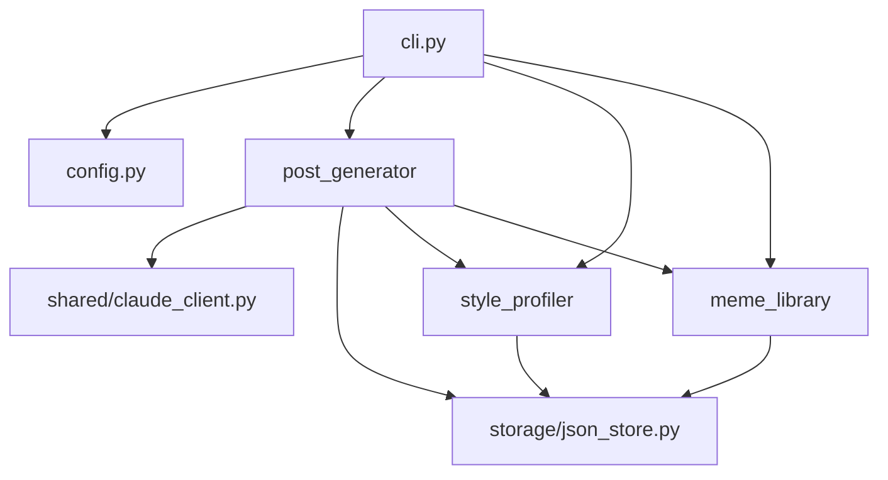

**Status:** active
**RPI-Cycle:** 2
**Started:** 2026-05-03

# naver-blog-bot Foundation Slice Implementation Plan

> **For agentic workers:** REQUIRED SUB-SKILL: Use superpowers:subagent-driven-development (recommended) or superpowers:executing-plans to implement this plan task-by-task. Steps use checkbox (`- [ ]`) syntax for tracking.

**Goal:** Build the first executable Python foundation for `naver-blog-bot`: package metadata, configuration, local JSON storage, draft models, Claude client wrapper, draft generation service, and safe Typer CLI draft/preview flow.

**Architecture:** This plan implements a narrow vertical slice of the approved Phase 1 design. The CLI coordinates focused modules while domain logic stays in `config`, `storage`, `style_profiler`, `meme_library`, `post_generator`, and `shared/claude_client.py`; publishing, scraping, meme vision tagging, and SmartEditor automation remain outside this foundation slice.

**Tech Stack:** Python 3.11+, uv, Typer, pydantic, pydantic-settings, Anthropic Python SDK, pytest, JSON file storage.

---

## Execution Notes

- Run all commands from the WSL project path: `/home/indietogo/projects/naver-blog-bot`.
- Do not run Git from the Windows UNC path because Git for Windows reports this repository as dubious ownership.
- Commit steps are included for task boundaries; if commit permission has not been granted for the implementation run, pause before the first commit and ask.
- Do not call the real Claude API in tests. Use injected fake clients only.
- Do not automate Naver login, CAPTCHA handling, SmartEditor publishing, or browser control in this foundation slice.

---

## Scope Check

The approved spec covers several independent subsystems: style scraping/profiling, meme vision tagging, Claude draft generation, Playwright publishing, OGQ insertion, EXIF stripping, and future Telegram reuse. This plan intentionally implements only the foundation slice selected for this RPI cycle:

- Python package and `naver-bot` entrypoint
- Local settings and gitignored state paths
- JSON storage helpers
- Draft model, repository, preview rendering
- Style profile and meme index data models/loaders
- Prompt-caching-aware Claude text helper
- Draft generation service with injectable Claude client
- Typer CLI commands for local setup, draft creation, and preview
- Safe command surface for Phase 1 commands outside this slice
- AI context updates for the new architecture

---

## File Structure

- Create: `pyproject.toml`
  - Responsibility: Python package metadata, uv dependency declarations, test configuration, CLI script entrypoint.
- Modify: `.gitignore`
  - Responsibility: keep local personal state, generated drafts, meme assets, and browser session data out of git.
- Create: `src/naver_blog_bot/__init__.py`
  - Responsibility: package version marker.
- Create: `src/naver_blog_bot/config.py`
  - Responsibility: pydantic-settings configuration and local state directory creation.
- Create: `src/naver_blog_bot/storage/__init__.py`
  - Responsibility: storage package marker.
- Create: `src/naver_blog_bot/storage/json_store.py`
  - Responsibility: deterministic UTF-8 JSON read/write helpers.
- Create: `src/naver_blog_bot/post_generator/__init__.py`
  - Responsibility: post generator package marker.
- Create: `src/naver_blog_bot/post_generator/models.py`
  - Responsibility: draft data model and preview formatting.
- Create: `src/naver_blog_bot/post_generator/drafts.py`
  - Responsibility: draft ID generation and draft repository persistence.
- Create: `src/naver_blog_bot/style_profiler/__init__.py`
  - Responsibility: style profiler package marker.
- Create: `src/naver_blog_bot/style_profiler/models.py`
  - Responsibility: style profile schema used by generation prompts.
- Create: `src/naver_blog_bot/style_profiler/service.py`
  - Responsibility: load/save style profile JSON, returning an empty profile when the file does not exist.
- Create: `src/naver_blog_bot/meme_library/__init__.py`
  - Responsibility: meme library package marker.
- Create: `src/naver_blog_bot/meme_library/models.py`
  - Responsibility: meme asset/index schema and simple relevance ranking.
- Create: `src/naver_blog_bot/meme_library/service.py`
  - Responsibility: load/save meme index JSON, returning an empty index when the file does not exist.
- Create: `src/naver_blog_bot/shared/__init__.py`
  - Responsibility: shared package marker.
- Create: `src/naver_blog_bot/shared/claude_client.py`
  - Responsibility: central Anthropic SDK usage and prompt-caching-aware text completion helper.
- Create: `src/naver_blog_bot/post_generator/generator.py`
  - Responsibility: compose generation prompts from memo, photo paths, style profile, meme candidates, and Claude text output.
- Create: `src/naver_blog_bot/cli.py`
  - Responsibility: Typer CLI command routing only.
- Create: `tests/unit/test_config.py`
  - Responsibility: settings defaults, env overrides, directory creation.
- Create: `tests/unit/test_json_store.py`
  - Responsibility: JSON helper behavior.
- Create: `tests/unit/test_drafts.py`
  - Responsibility: draft persistence and preview formatting.
- Create: `tests/unit/test_style_and_memes.py`
  - Responsibility: style profile and meme index loading/ranking.
- Create: `tests/unit/test_claude_client.py`
  - Responsibility: Anthropic request shape without network calls.
- Create: `tests/unit/test_post_generator.py`
  - Responsibility: prompt construction and draft composition with fake Claude output.
- Create: `tests/unit/test_cli.py`
  - Responsibility: CLI setup, draft, preview, and safe command surface.
- Modify: `docs/ai-context/architecture.md`
  - Responsibility: live module graph, data flow, ADR-001.
- Modify: `docs/ai-context/domain-glossary.md`
  - Responsibility: map confirmed domain terms to code identifiers.
- Modify: `docs/ai-context/runbook.md`
  - Responsibility: local setup, test, draft, preview commands.

---

### Task 1: Package Metadata and Settings

**Files:**
- Create: `pyproject.toml`
- Modify: `.gitignore`
- Create: `src/naver_blog_bot/__init__.py`
- Create: `src/naver_blog_bot/config.py`
- Test: `tests/unit/test_config.py`

- [ ] **Step 1: Create package metadata**

Create `pyproject.toml`:

```toml
[project]
name = "naver-blog-bot"
version = "0.1.0"
description = "Local CLI for drafting Naver Blog posts from photos and memos."
requires-python = ">=3.11"
dependencies = [
  "anthropic>=0.72.0",
  "pydantic>=2.10.0",
  "pydantic-settings>=2.6.0",
  "typer>=0.21.1",
]

[project.scripts]
naver-bot = "naver_blog_bot.cli:main"

[dependency-groups]
dev = [
  "pytest>=8.3.0",
]

[build-system]
requires = ["hatchling"]
build-backend = "hatchling.build"

[tool.pytest.ini_options]
testpaths = ["tests"]
pythonpath = ["src"]
```

- [ ] **Step 2: Add local state paths to gitignore**

Append this block to `.gitignore`:

```gitignore

# naver-blog-bot local state
config/style_profile.json
config/meme_index.json
assets/memes/
drafts/
browser-profile/
```

- [ ] **Step 3: Write the failing settings tests**

Create `tests/unit/test_config.py`:

```python
from pathlib import Path

from naver_blog_bot.config import Settings, ensure_local_directories


def test_settings_defaults_point_to_project_local_paths() -> None:
    settings = Settings()

    assert settings.blog_url == "https://blog.naver.com/flowerbend"
    assert settings.ogq_artwork_id == "644e042a7d7f8"
    assert settings.ogq_name == "세루리안"
    assert settings.config_dir.name == "config"
    assert settings.drafts_dir.name == "drafts"
    assert settings.memes_dir.parts[-2:] == ("assets", "memes")
    assert settings.browser_profile_dir.name == "browser-profile"
    assert settings.style_profile_path == settings.config_dir / "style_profile.json"
    assert settings.meme_index_path == settings.config_dir / "meme_index.json"
    assert settings.claude_model == "claude-opus-4-7"
    assert settings.claude_max_tokens == 4000


def test_settings_accept_environment_path_overrides(monkeypatch, tmp_path: Path) -> None:
    drafts_dir = tmp_path / "draft-output"
    monkeypatch.setenv("NAVER_BOT_DRAFTS_DIR", str(drafts_dir))

    settings = Settings()

    assert settings.drafts_dir == drafts_dir


def test_ensure_local_directories_creates_expected_paths(tmp_path: Path) -> None:
    settings = Settings(
        config_dir=tmp_path / "config",
        drafts_dir=tmp_path / "drafts",
        memes_dir=tmp_path / "assets" / "memes",
        browser_profile_dir=tmp_path / "browser-profile",
    )

    created = ensure_local_directories(settings)

    assert created == [
        settings.config_dir,
        settings.drafts_dir,
        settings.memes_dir,
        settings.browser_profile_dir,
    ]
    for path in created:
        assert path.is_dir()
```

- [ ] **Step 4: Run the settings tests to verify failure**

Run:

```bash
uv run pytest tests/unit/test_config.py -v
```

Expected: FAIL with `ModuleNotFoundError: No module named 'naver_blog_bot'` or `ImportError` for `Settings`.

- [ ] **Step 5: Implement package version and settings**

Create `src/naver_blog_bot/__init__.py`:

```python
__version__ = "0.1.0"
```

Create `src/naver_blog_bot/config.py`:

```python
from pathlib import Path

from pydantic import Field
from pydantic_settings import BaseSettings, SettingsConfigDict

PROJECT_ROOT = Path(__file__).resolve().parents[2]


class Settings(BaseSettings):
    model_config = SettingsConfigDict(
        env_prefix="NAVER_BOT_",
        env_file=".env",
        env_file_encoding="utf-8",
        extra="ignore",
    )

    blog_url: str = "https://blog.naver.com/flowerbend"
    ogq_artwork_id: str = "644e042a7d7f8"
    ogq_name: str = "세루리안"
    config_dir: Path = Field(default_factory=lambda: PROJECT_ROOT / "config")
    drafts_dir: Path = Field(default_factory=lambda: PROJECT_ROOT / "drafts")
    memes_dir: Path = Field(default_factory=lambda: PROJECT_ROOT / "assets" / "memes")
    browser_profile_dir: Path = Field(default_factory=lambda: PROJECT_ROOT / "browser-profile")
    claude_model: str = "claude-opus-4-7"
    claude_max_tokens: int = 4000

    @property
    def style_profile_path(self) -> Path:
        return self.config_dir / "style_profile.json"

    @property
    def meme_index_path(self) -> Path:
        return self.config_dir / "meme_index.json"


def get_settings() -> Settings:
    return Settings()


def ensure_local_directories(settings: Settings) -> list[Path]:
    paths = [
        settings.config_dir,
        settings.drafts_dir,
        settings.memes_dir,
        settings.browser_profile_dir,
    ]
    for path in paths:
        path.mkdir(parents=True, exist_ok=True)
    return paths
```

- [ ] **Step 6: Run the settings tests to verify pass**

Run:

```bash
uv run pytest tests/unit/test_config.py -v
```

Expected: PASS with `3 passed`.

- [ ] **Step 7: Commit package metadata and settings**

Run:

```bash
git add pyproject.toml .gitignore src/naver_blog_bot/__init__.py src/naver_blog_bot/config.py tests/unit/test_config.py
git commit -m "$(cat <<'EOF'
Build Python package foundation

Add project metadata, local settings, and gitignored state paths so the CLI can manage user-local files without committing personal data.

Co-Authored-By: Claude Sonnet 4.6 <noreply@anthropic.com>
EOF
)"
```

Expected: commit succeeds and only the listed files are included.

---

### Task 2: JSON Storage and Draft Repository

**Files:**
- Create: `src/naver_blog_bot/storage/__init__.py`
- Create: `src/naver_blog_bot/storage/json_store.py`
- Create: `src/naver_blog_bot/post_generator/__init__.py`
- Create: `src/naver_blog_bot/post_generator/models.py`
- Create: `src/naver_blog_bot/post_generator/drafts.py`
- Test: `tests/unit/test_json_store.py`
- Test: `tests/unit/test_drafts.py`

- [ ] **Step 1: Write failing JSON storage tests**

Create `tests/unit/test_json_store.py`:

```python
from pathlib import Path

from naver_blog_bot.storage.json_store import read_json, write_json


def test_write_json_creates_parent_and_preserves_korean_text(tmp_path: Path) -> None:
    path = tmp_path / "nested" / "payload.json"

    write_json(path, {"memo": "포포몬 체험단 후기", "count": 2})

    assert path.exists()
    assert path.read_text(encoding="utf-8").endswith("\n")
    assert read_json(path) == {"memo": "포포몬 체험단 후기", "count": 2}
```

- [ ] **Step 2: Write failing draft repository tests**

Create `tests/unit/test_drafts.py`:

```python
from datetime import datetime, timezone
from pathlib import Path

from naver_blog_bot.post_generator.drafts import DraftRepository, draft_id_from_time
from naver_blog_bot.post_generator.models import Draft


def test_draft_id_from_time_is_stable() -> None:
    now = datetime(2026, 5, 3, 12, 34, 56, tzinfo=timezone.utc)

    assert draft_id_from_time(now) == "draft-20260503-123456"


def test_draft_repository_saves_and_loads_json(tmp_path: Path) -> None:
    created_at = datetime(2026, 5, 3, 12, 0, 0, tzinfo=timezone.utc)
    draft = Draft(
        id="draft-20260503-120000",
        title="포포몬 체험단 후기",
        memo="사진은 다섯 장이고 첫인상이 좋았음",
        body_markdown="# 포포몬 체험단 후기\n\n본문입니다.",
        photo_paths=[Path("photos/one.jpg"), Path("photos/two.jpg")],
        selected_memes=[Path("assets/memes/smile.png")],
        ogq_artwork_id="644e042a7d7f8",
        created_at=created_at,
    )
    repo = DraftRepository(tmp_path)

    saved_path = repo.save(draft)
    loaded = repo.load("draft-20260503-120000")

    assert saved_path == tmp_path / "draft-20260503-120000.json"
    assert loaded == draft


def test_draft_preview_text_is_readable() -> None:
    draft = Draft(
        id="draft-20260503-120000",
        title="포포몬 체험단 후기",
        memo="첫인상이 좋았음",
        body_markdown="# 포포몬 체험단 후기\n\n본문입니다.",
        photo_paths=[Path("photos/one.jpg")],
        selected_memes=[],
        ogq_artwork_id="644e042a7d7f8",
        created_at=datetime(2026, 5, 3, 12, 0, 0, tzinfo=timezone.utc),
    )

    preview = draft.preview_text()

    assert "Draft ID: draft-20260503-120000" in preview
    assert "Memo: 첫인상이 좋았음" in preview
    assert "photos/one.jpg" in preview
    assert "OGQ: 644e042a7d7f8" in preview
    assert "# 포포몬 체험단 후기" in preview
```

- [ ] **Step 3: Run storage and draft tests to verify failure**

Run:

```bash
uv run pytest tests/unit/test_json_store.py tests/unit/test_drafts.py -v
```

Expected: FAIL with `ModuleNotFoundError` for `naver_blog_bot.storage` or `naver_blog_bot.post_generator`.

- [ ] **Step 4: Implement JSON storage helpers**

Create `src/naver_blog_bot/storage/__init__.py`:

```python
```

Create `src/naver_blog_bot/storage/json_store.py`:

```python
import json
from pathlib import Path
from typing import Any


def write_json(path: Path, payload: dict[str, Any]) -> None:
    path.parent.mkdir(parents=True, exist_ok=True)
    text = json.dumps(payload, ensure_ascii=False, indent=2, sort_keys=True)
    path.write_text(f"{text}\n", encoding="utf-8")


def read_json(path: Path) -> dict[str, Any]:
    return json.loads(path.read_text(encoding="utf-8"))
```

- [ ] **Step 5: Implement draft model and repository**

Create `src/naver_blog_bot/post_generator/__init__.py`:

```python
```

Create `src/naver_blog_bot/post_generator/models.py`:

```python
from datetime import datetime, timezone
from pathlib import Path

from pydantic import BaseModel, Field


class Draft(BaseModel):
    id: str
    title: str
    memo: str
    body_markdown: str
    photo_paths: list[Path]
    selected_memes: list[Path] = Field(default_factory=list)
    ogq_artwork_id: str | None = None
    created_at: datetime = Field(default_factory=lambda: datetime.now(timezone.utc))

    def preview_text(self) -> str:
        photos = "\n".join(f"- {path}" for path in self.photo_paths) or "- (none)"
        memes = "\n".join(f"- {path}" for path in self.selected_memes) or "- (none)"
        ogq = self.ogq_artwork_id or "(none)"
        return (
            f"# {self.title}\n\n"
            f"Draft ID: {self.id}\n\n"
            f"Created: {self.created_at.isoformat()}\n\n"
            f"Memo: {self.memo}\n\n"
            f"Photos:\n{photos}\n\n"
            f"OGQ: {ogq}\n\n"
            f"Memes:\n{memes}\n\n"
            f"---\n\n"
            f"{self.body_markdown}\n"
        )
```

Create `src/naver_blog_bot/post_generator/drafts.py`:

```python
from datetime import datetime
from pathlib import Path

from naver_blog_bot.post_generator.models import Draft
from naver_blog_bot.storage.json_store import read_json, write_json


def draft_id_from_time(now: datetime) -> str:
    return now.strftime("draft-%Y%m%d-%H%M%S")


class DraftRepository:
    def __init__(self, drafts_dir: Path) -> None:
        self.drafts_dir = drafts_dir

    def path_for(self, draft_id: str) -> Path:
        return self.drafts_dir / f"{draft_id}.json"

    def save(self, draft: Draft) -> Path:
        path = self.path_for(draft.id)
        write_json(path, draft.model_dump(mode="json"))
        return path

    def load(self, draft_id: str) -> Draft:
        return Draft.model_validate(read_json(self.path_for(draft_id)))
```

- [ ] **Step 6: Run storage and draft tests to verify pass**

Run:

```bash
uv run pytest tests/unit/test_json_store.py tests/unit/test_drafts.py -v
```

Expected: PASS with `4 passed`.

- [ ] **Step 7: Commit storage and draft repository**

Run:

```bash
git add src/naver_blog_bot/storage src/naver_blog_bot/post_generator tests/unit/test_json_store.py tests/unit/test_drafts.py
git commit -m "$(cat <<'EOF'
Add JSON draft persistence

Store generated drafts as readable local JSON artifacts so draft creation and preview can work before publishing automation exists.

Co-Authored-By: Claude Sonnet 4.6 <noreply@anthropic.com>
EOF
)"
```

Expected: commit succeeds and only storage, draft, and related test files are included.

---

### Task 3: Style Profile and Meme Index Schemas

**Files:**
- Create: `src/naver_blog_bot/style_profiler/__init__.py`
- Create: `src/naver_blog_bot/style_profiler/models.py`
- Create: `src/naver_blog_bot/style_profiler/service.py`
- Create: `src/naver_blog_bot/meme_library/__init__.py`
- Create: `src/naver_blog_bot/meme_library/models.py`
- Create: `src/naver_blog_bot/meme_library/service.py`
- Test: `tests/unit/test_style_and_memes.py`

- [ ] **Step 1: Write failing style and meme tests**

Create `tests/unit/test_style_and_memes.py`:

```python
from datetime import datetime, timezone
from pathlib import Path

from naver_blog_bot.meme_library.models import MemeAsset, MemeIndex
from naver_blog_bot.meme_library.service import load_meme_index, save_meme_index
from naver_blog_bot.style_profiler.models import StyleProfile
from naver_blog_bot.style_profiler.service import load_style_profile, save_style_profile


def test_missing_style_profile_returns_empty_profile(tmp_path: Path) -> None:
    profile = load_style_profile(tmp_path / "missing.json", "https://blog.naver.com/flowerbend")

    assert profile.blog_url == "https://blog.naver.com/flowerbend"
    assert profile.structure_patterns == []
    assert profile.tone_keywords == []


def test_style_profile_round_trip(tmp_path: Path) -> None:
    profile = StyleProfile(
        blog_url="https://blog.naver.com/flowerbend",
        updated_at=datetime(2026, 5, 3, 12, 0, 0, tzinfo=timezone.utc),
        structure_patterns=["도입부에 개인 경험을 먼저 말한다"],
        tone_keywords=["다정함", "솔직함"],
        frequent_expressions=["완전 만족"],
        review_conventions=["첫인상 다음에 사용 경험을 설명"],
        photo_usage_notes=["사진 사이에 짧은 감탄사를 넣음"],
    )
    path = tmp_path / "style_profile.json"

    save_style_profile(path, profile)

    assert load_style_profile(path, profile.blog_url) == profile
    assert "완전 만족" in profile.to_cache_text()


def test_missing_meme_index_returns_empty_index(tmp_path: Path) -> None:
    index = load_meme_index(tmp_path / "missing.json")

    assert index.memes == []


def test_meme_index_round_trip_and_candidate_ranking(tmp_path: Path) -> None:
    index = MemeIndex(
        updated_at=datetime(2026, 5, 3, 12, 0, 0, tzinfo=timezone.utc),
        memes=[
            MemeAsset(
                id="satisfied",
                path=Path("assets/memes/satisfied.png"),
                tags=["satisfaction", "food"],
                use_cases=["맛있었을 때", "만족"],
                alt_text="만족하는 표정",
            ),
            MemeAsset(
                id="surprise",
                path=Path("assets/memes/surprise.png"),
                tags=["surprise"],
                use_cases=["예상 밖"],
                alt_text="놀란 표정",
            ),
        ],
    )
    path = tmp_path / "meme_index.json"

    save_meme_index(path, index)
    loaded = load_meme_index(path)

    assert loaded == index
    assert loaded.candidates_for_memo("음식이 맛있고 만족", limit=1)[0].id == "satisfied"
    assert "satisfied.png" in loaded.to_cache_text()
```

- [ ] **Step 2: Run style and meme tests to verify failure**

Run:

```bash
uv run pytest tests/unit/test_style_and_memes.py -v
```

Expected: FAIL with `ModuleNotFoundError` for `naver_blog_bot.style_profiler` or `naver_blog_bot.meme_library`.

- [ ] **Step 3: Implement style profile schema and service**

Create `src/naver_blog_bot/style_profiler/__init__.py`:

```python
```

Create `src/naver_blog_bot/style_profiler/models.py`:

```python
import json
from datetime import datetime, timezone

from pydantic import BaseModel, Field


class StyleProfile(BaseModel):
    blog_url: str
    updated_at: datetime = Field(default_factory=lambda: datetime.now(timezone.utc))
    structure_patterns: list[str] = Field(default_factory=list)
    tone_keywords: list[str] = Field(default_factory=list)
    frequent_expressions: list[str] = Field(default_factory=list)
    review_conventions: list[str] = Field(default_factory=list)
    photo_usage_notes: list[str] = Field(default_factory=list)

    def to_cache_text(self) -> str:
        return json.dumps(self.model_dump(mode="json"), ensure_ascii=False, indent=2, sort_keys=True)
```

Create `src/naver_blog_bot/style_profiler/service.py`:

```python
from pathlib import Path

from naver_blog_bot.storage.json_store import read_json, write_json
from naver_blog_bot.style_profiler.models import StyleProfile


def load_style_profile(path: Path, blog_url: str) -> StyleProfile:
    if not path.exists():
        return StyleProfile(blog_url=blog_url)
    return StyleProfile.model_validate(read_json(path))


def save_style_profile(path: Path, profile: StyleProfile) -> None:
    write_json(path, profile.model_dump(mode="json"))
```

- [ ] **Step 4: Implement meme index schema and service**

Create `src/naver_blog_bot/meme_library/__init__.py`:

```python
```

Create `src/naver_blog_bot/meme_library/models.py`:

```python
import json
from datetime import datetime, timezone
from pathlib import Path

from pydantic import BaseModel, Field


class MemeAsset(BaseModel):
    id: str
    path: Path
    tags: list[str] = Field(default_factory=list)
    use_cases: list[str] = Field(default_factory=list)
    alt_text: str = ""


class MemeIndex(BaseModel):
    updated_at: datetime = Field(default_factory=lambda: datetime.now(timezone.utc))
    memes: list[MemeAsset] = Field(default_factory=list)

    def candidates_for_memo(self, memo: str, limit: int = 3) -> list[MemeAsset]:
        normalized = memo.lower()
        scored: list[tuple[int, MemeAsset]] = []
        for meme in self.memes:
            score = sum(1 for tag in meme.tags if tag.lower() in normalized)
            score += sum(1 for use_case in meme.use_cases if use_case.lower() in normalized)
            if score > 0:
                scored.append((score, meme))
        scored.sort(key=lambda item: (-item[0], item[1].id))
        return [meme for _, meme in scored[:limit]]

    def to_cache_text(self) -> str:
        return json.dumps(self.model_dump(mode="json"), ensure_ascii=False, indent=2, sort_keys=True)
```

Create `src/naver_blog_bot/meme_library/service.py`:

```python
from pathlib import Path

from naver_blog_bot.meme_library.models import MemeIndex
from naver_blog_bot.storage.json_store import read_json, write_json


def load_meme_index(path: Path) -> MemeIndex:
    if not path.exists():
        return MemeIndex()
    return MemeIndex.model_validate(read_json(path))


def save_meme_index(path: Path, index: MemeIndex) -> None:
    write_json(path, index.model_dump(mode="json"))
```

- [ ] **Step 5: Run style and meme tests to verify pass**

Run:

```bash
uv run pytest tests/unit/test_style_and_memes.py -v
```

Expected: PASS with `4 passed`.

- [ ] **Step 6: Commit style and meme schemas**

Run:

```bash
git add src/naver_blog_bot/style_profiler src/naver_blog_bot/meme_library tests/unit/test_style_and_memes.py
git commit -m "$(cat <<'EOF'
Add style and meme data schemas

Represent reusable style guidance and meme candidates as local JSON-backed models for draft generation prompts.

Co-Authored-By: Claude Sonnet 4.6 <noreply@anthropic.com>
EOF
)"
```

Expected: commit succeeds and only style, meme, and related test files are included.

---

### Task 4: Claude Client Wrapper

**Files:**
- Create: `src/naver_blog_bot/shared/__init__.py`
- Create: `src/naver_blog_bot/shared/claude_client.py`
- Test: `tests/unit/test_claude_client.py`

- [ ] **Step 1: Write failing Claude client tests**

Create `tests/unit/test_claude_client.py`:

```python
from types import SimpleNamespace

from naver_blog_bot.config import Settings
from naver_blog_bot.shared.claude_client import ClaudeTextClient


class FakeMessages:
    def __init__(self) -> None:
        self.last_kwargs = None

    def create(self, **kwargs):
        self.last_kwargs = kwargs
        return SimpleNamespace(content=[SimpleNamespace(type="text", text="생성된 본문")])


class FakeAnthropic:
    def __init__(self) -> None:
        self.messages = FakeMessages()


def test_complete_text_uses_configured_model_and_cache_blocks() -> None:
    fake = FakeAnthropic()
    settings = Settings(claude_model="claude-opus-4-7", claude_max_tokens=1234)
    client = ClaudeTextClient(settings=settings, anthropic_client=fake)

    text = client.complete_text(
        system_prompt="너는 블로그 글쓰기 도우미다.",
        cacheable_context=["style profile", "meme index"],
        user_prompt="메모로 초안을 작성해줘.",
    )

    assert text == "생성된 본문"
    assert fake.messages.last_kwargs["model"] == "claude-opus-4-7"
    assert fake.messages.last_kwargs["max_tokens"] == 1234
    assert fake.messages.last_kwargs["thinking"] == {"type": "adaptive"}
    assert fake.messages.last_kwargs["messages"] == [
        {"role": "user", "content": "메모로 초안을 작성해줘."}
    ]
    assert fake.messages.last_kwargs["system"] == [
        {"type": "text", "text": "너는 블로그 글쓰기 도우미다."},
        {"type": "text", "text": "style profile", "cache_control": {"type": "ephemeral"}},
        {"type": "text", "text": "meme index", "cache_control": {"type": "ephemeral"}},
    ]


def test_complete_text_accepts_dict_text_blocks_from_fake_clients() -> None:
    class DictMessages:
        def create(self, **kwargs):
            return SimpleNamespace(content=[{"type": "text", "text": "딕셔너리 본문"}])

    fake = SimpleNamespace(messages=DictMessages())
    client = ClaudeTextClient(settings=Settings(), anthropic_client=fake)

    assert client.complete_text(system_prompt="system", user_prompt="user") == "딕셔너리 본문"
```

- [ ] **Step 2: Run Claude client tests to verify failure**

Run:

```bash
uv run pytest tests/unit/test_claude_client.py -v
```

Expected: FAIL with `ModuleNotFoundError: No module named 'naver_blog_bot.shared'`.

- [ ] **Step 3: Implement shared Claude client wrapper**

Create `src/naver_blog_bot/shared/__init__.py`:

```python
```

Create `src/naver_blog_bot/shared/claude_client.py`:

```python
from collections.abc import Sequence
from typing import Any

from anthropic import Anthropic

from naver_blog_bot.config import Settings


class ClaudeTextClient:
    def __init__(self, settings: Settings, anthropic_client: Any | None = None) -> None:
        self.settings = settings
        self.client = anthropic_client or Anthropic()

    def complete_text(
        self,
        *,
        system_prompt: str,
        user_prompt: str,
        cacheable_context: Sequence[str] = (),
    ) -> str:
        system_blocks: list[dict[str, Any]] = [{"type": "text", "text": system_prompt}]
        for context in cacheable_context:
            system_blocks.append(
                {"type": "text", "text": context, "cache_control": {"type": "ephemeral"}}
            )

        message = self.client.messages.create(
            model=self.settings.claude_model,
            max_tokens=self.settings.claude_max_tokens,
            thinking={"type": "adaptive"},
            system=system_blocks,
            messages=[{"role": "user", "content": user_prompt}],
        )

        parts: list[str] = []
        for block in message.content:
            if isinstance(block, dict) and block.get("type") == "text":
                parts.append(str(block["text"]))
            elif getattr(block, "type", None) == "text":
                parts.append(str(block.text))
        return "".join(parts).strip()
```

- [ ] **Step 4: Run Claude client tests to verify pass**

Run:

```bash
uv run pytest tests/unit/test_claude_client.py -v
```

Expected: PASS with `2 passed`.

- [ ] **Step 5: Commit Claude client wrapper**

Run:

```bash
git add src/naver_blog_bot/shared tests/unit/test_claude_client.py
git commit -m "$(cat <<'EOF'
Centralize Claude text requests

Add an injectable Anthropic SDK wrapper with cacheable context blocks so generation code can be tested without network calls.

Co-Authored-By: Claude Sonnet 4.6 <noreply@anthropic.com>
EOF
)"
```

Expected: commit succeeds and only shared Claude client files and tests are included.

---

### Task 5: Draft Generation Service

**Files:**
- Create: `src/naver_blog_bot/post_generator/generator.py`
- Test: `tests/unit/test_post_generator.py`

- [ ] **Step 1: Write failing post generator tests**

Create `tests/unit/test_post_generator.py`:

```python
from datetime import datetime, timezone
from pathlib import Path

from naver_blog_bot.config import Settings
from naver_blog_bot.meme_library.models import MemeAsset, MemeIndex
from naver_blog_bot.post_generator.generator import PostGenerator, extract_title
from naver_blog_bot.style_profiler.models import StyleProfile


class FakeClaude:
    def __init__(self) -> None:
        self.last_call = None

    def complete_text(self, **kwargs: object) -> str:
        self.last_call = kwargs
        return "# 포포몬 체험단 후기\n\n사진을 보니 첫인상이 정말 좋았어요."


def test_extract_title_uses_first_markdown_heading() -> None:
    assert extract_title("# 포포몬 체험단 후기\n\n본문") == "포포몬 체험단 후기"


def test_extract_title_falls_back_for_empty_markdown() -> None:
    assert extract_title("\n\n") == "네이버 블로그 초안"


def test_post_generator_builds_draft_with_cacheable_context() -> None:
    fake = FakeClaude()
    now = datetime(2026, 5, 3, 12, 0, 0, tzinfo=timezone.utc)
    settings = Settings(ogq_artwork_id="644e042a7d7f8")
    generator = PostGenerator(settings=settings, claude_client=fake, now=lambda: now)
    style_profile = StyleProfile(
        blog_url="https://blog.naver.com/flowerbend",
        updated_at=now,
        frequent_expressions=["완전 만족"],
        review_conventions=["첫인상 다음 사용 경험"],
    )
    meme_index = MemeIndex(
        updated_at=now,
        memes=[
            MemeAsset(
                id="satisfied",
                path=Path("assets/memes/satisfied.png"),
                tags=["satisfaction"],
                use_cases=["만족"],
                alt_text="만족하는 표정",
            )
        ],
    )

    draft = generator.generate(
        photo_paths=[Path("photos/one.jpg"), Path("photos/two.jpg")],
        memo="제품이 만족스럽고 사진은 두 장",
        style_profile=style_profile,
        meme_index=meme_index,
    )

    assert draft.id == "draft-20260503-120000"
    assert draft.title == "포포몬 체험단 후기"
    assert draft.memo == "제품이 만족스럽고 사진은 두 장"
    assert draft.photo_paths == [Path("photos/one.jpg"), Path("photos/two.jpg")]
    assert draft.selected_memes == [Path("assets/memes/satisfied.png")]
    assert draft.ogq_artwork_id == "644e042a7d7f8"
    assert "사진을 보니" in draft.body_markdown
    assert fake.last_call["system_prompt"].startswith("너는 네이버 블로그")
    assert "완전 만족" in fake.last_call["cacheable_context"][0]
    assert "satisfied.png" in fake.last_call["cacheable_context"][1]
    assert "제품이 만족스럽고 사진은 두 장" in fake.last_call["user_prompt"]
    assert "photos/one.jpg" in fake.last_call["user_prompt"]
```

- [ ] **Step 2: Run post generator tests to verify failure**

Run:

```bash
uv run pytest tests/unit/test_post_generator.py -v
```

Expected: FAIL with `ModuleNotFoundError` for `naver_blog_bot.post_generator.generator`.

- [ ] **Step 3: Implement post generator service**

Create `src/naver_blog_bot/post_generator/generator.py`:

```python
from collections.abc import Callable
from datetime import datetime, timezone
from pathlib import Path
from typing import Protocol

from naver_blog_bot.config import Settings
from naver_blog_bot.meme_library.models import MemeIndex
from naver_blog_bot.post_generator.drafts import draft_id_from_time
from naver_blog_bot.post_generator.models import Draft
from naver_blog_bot.style_profiler.models import StyleProfile

SYSTEM_PROMPT = """너는 네이버 블로그 체험단 후기 초안을 작성하는 한국어 글쓰기 도우미다.
사용자의 기존 문체를 우선하고, 과장된 광고 문장보다 실제 사용 경험처럼 자연스럽게 쓴다.
사진 위치, OGQ 이모티콘, 짤방 후보는 초안에 사람이 검토할 수 있는 표시로 남긴다."""


class TextCompleter(Protocol):
    def complete_text(
        self,
        *,
        system_prompt: str,
        user_prompt: str,
        cacheable_context: list[str],
    ) -> str:
        ...


def extract_title(markdown: str) -> str:
    for line in markdown.splitlines():
        stripped = line.strip().lstrip("#").strip()
        if stripped:
            return stripped[:80]
    return "네이버 블로그 초안"


class PostGenerator:
    def __init__(
        self,
        *,
        settings: Settings,
        claude_client: TextCompleter,
        now: Callable[[], datetime] | None = None,
    ) -> None:
        self.settings = settings
        self.claude_client = claude_client
        self.now = now or (lambda: datetime.now(timezone.utc))

    def generate(
        self,
        *,
        photo_paths: list[Path],
        memo: str,
        style_profile: StyleProfile,
        meme_index: MemeIndex,
    ) -> Draft:
        selected_memes = meme_index.candidates_for_memo(memo)
        body_markdown = self.claude_client.complete_text(
            system_prompt=SYSTEM_PROMPT,
            cacheable_context=[style_profile.to_cache_text(), meme_index.to_cache_text()],
            user_prompt=self._build_user_prompt(photo_paths, memo, selected_memes),
        )
        created_at = self.now()
        return Draft(
            id=draft_id_from_time(created_at),
            title=extract_title(body_markdown),
            memo=memo,
            body_markdown=body_markdown,
            photo_paths=photo_paths,
            selected_memes=[meme.path for meme in selected_memes],
            ogq_artwork_id=self.settings.ogq_artwork_id,
            created_at=created_at,
        )

    def _build_user_prompt(self, photo_paths, memo, selected_memes) -> str:
        photos = "\n".join(f"- {path}" for path in photo_paths)
        memes = "\n".join(
            f"- {meme.id}: {meme.path} ({', '.join(meme.use_cases)})" for meme in selected_memes
        ) or "- 선택된 짤방 없음"
        return f"""다음 메모와 사진 목록을 바탕으로 네이버 블로그 초안을 작성해줘.

메모:
{memo}

사진 경로:
{photos}

사용 가능한 OGQ 이모티콘:
- artworkId: {self.settings.ogq_artwork_id}
- name: {self.settings.ogq_name}

추천 짤방 후보:
{memes}

출력 형식:
- 첫 줄은 마크다운 H1 제목으로 작성
- 본문은 한국어 마크다운으로 작성
- 사진을 넣을 위치는 `[사진: 파일경로]` 형식으로 표시
- OGQ를 넣을 위치는 `[OGQ: {self.settings.ogq_name}]` 형식으로 표시
- 짤방을 넣을 위치는 `[짤방: 파일경로]` 형식으로 표시
"""
```

- [ ] **Step 4: Run post generator tests to verify pass**

Run:

```bash
uv run pytest tests/unit/test_post_generator.py -v
```

Expected: PASS with `3 passed`.

- [ ] **Step 5: Commit post generator service**

Run:

```bash
git add src/naver_blog_bot/post_generator/generator.py tests/unit/test_post_generator.py
git commit -m "$(cat <<'EOF'
Add draft generation service

Compose style profile, meme candidates, photos, and memo into a Claude-backed draft object without coupling generation to publishing.

Co-Authored-By: Claude Sonnet 4.6 <noreply@anthropic.com>
EOF
)"
```

Expected: commit succeeds and only generator service and tests are included.

---

### Task 6: Typer CLI Foundation

**Files:**
- Create: `src/naver_blog_bot/cli.py`
- Test: `tests/unit/test_cli.py`

- [ ] **Step 1: Write failing CLI tests**

Create `tests/unit/test_cli.py`:

```python
from pathlib import Path

from typer.testing import CliRunner

from naver_blog_bot import cli
from naver_blog_bot.post_generator.drafts import DraftRepository
from naver_blog_bot.post_generator.models import Draft

runner = CliRunner()


class FakeGenerator:
    def generate(self, *, photo_paths, memo, style_profile, meme_index):
        return Draft(
            id="draft-20260503-120000",
            title="포포몬 체험단 후기",
            memo=memo,
            body_markdown="# 포포몬 체험단 후기\n\n본문입니다.",
            photo_paths=photo_paths,
            selected_memes=[],
            ogq_artwork_id="644e042a7d7f8",
        )


def configure_paths(monkeypatch, tmp_path: Path) -> None:
    monkeypatch.setenv("NAVER_BOT_CONFIG_DIR", str(tmp_path / "config"))
    monkeypatch.setenv("NAVER_BOT_DRAFTS_DIR", str(tmp_path / "drafts"))
    monkeypatch.setenv("NAVER_BOT_MEMES_DIR", str(tmp_path / "assets" / "memes"))
    monkeypatch.setenv("NAVER_BOT_BROWSER_PROFILE_DIR", str(tmp_path / "browser-profile"))


def test_init_creates_local_directories(monkeypatch, tmp_path: Path) -> None:
    configure_paths(monkeypatch, tmp_path)

    result = runner.invoke(cli.app, ["init"])

    assert result.exit_code == 0
    assert "Local project state is ready" in result.stdout
    assert (tmp_path / "config").is_dir()
    assert (tmp_path / "drafts").is_dir()
    assert (tmp_path / "assets" / "memes").is_dir()
    assert (tmp_path / "browser-profile").is_dir()


def test_draft_saves_generated_draft(monkeypatch, tmp_path: Path) -> None:
    configure_paths(monkeypatch, tmp_path)
    photo = tmp_path / "photo.jpg"
    photo.write_bytes(b"fake image bytes")
    monkeypatch.setattr(cli, "build_generator", lambda settings: FakeGenerator())

    result = runner.invoke(cli.app, ["draft", str(photo), "제품이 만족스러웠음"])

    assert result.exit_code == 0
    assert "Draft saved: draft-20260503-120000" in result.stdout
    loaded = DraftRepository(tmp_path / "drafts").load("draft-20260503-120000")
    assert loaded.memo == "제품이 만족스러웠음"
    assert loaded.photo_paths == [photo]


def test_draft_requires_photo_and_memo(monkeypatch, tmp_path: Path) -> None:
    configure_paths(monkeypatch, tmp_path)

    result = runner.invoke(cli.app, ["draft", "메모만 있음"])

    assert result.exit_code != 0
    assert "provide at least one photo path and a memo" in result.stdout


def test_draft_rejects_missing_photo(monkeypatch, tmp_path: Path) -> None:
    configure_paths(monkeypatch, tmp_path)

    result = runner.invoke(cli.app, ["draft", str(tmp_path / "missing.jpg"), "메모"])

    assert result.exit_code != 0
    assert "photo not found" in result.stdout


def test_preview_outputs_saved_draft(monkeypatch, tmp_path: Path) -> None:
    configure_paths(monkeypatch, tmp_path)
    repo = DraftRepository(tmp_path / "drafts")
    repo.save(
        Draft(
            id="draft-20260503-120000",
            title="포포몬 체험단 후기",
            memo="미리보기 메모",
            body_markdown="# 포포몬 체험단 후기\n\n본문입니다.",
            photo_paths=[Path("photo.jpg")],
            ogq_artwork_id="644e042a7d7f8",
        )
    )

    result = runner.invoke(cli.app, ["preview", "draft-20260503-120000"])

    assert result.exit_code == 0
    assert "Draft ID: draft-20260503-120000" in result.stdout
    assert "미리보기 메모" in result.stdout


def test_publish_command_is_blocked_in_foundation_slice(monkeypatch, tmp_path: Path) -> None:
    configure_paths(monkeypatch, tmp_path)

    result = runner.invoke(cli.app, ["publish", "draft-20260503-120000"])

    assert result.exit_code == 1
    assert "publish is outside this foundation slice" in result.stdout
```

- [ ] **Step 2: Run CLI tests to verify failure**

Run:

```bash
uv run pytest tests/unit/test_cli.py -v
```

Expected: FAIL with `ImportError` for `naver_blog_bot.cli`.

- [ ] **Step 3: Implement Typer CLI**

Create `src/naver_blog_bot/cli.py`:

```python
from pathlib import Path
from typing import Annotated

import typer

from naver_blog_bot.config import Settings, ensure_local_directories, get_settings
from naver_blog_bot.meme_library.service import load_meme_index
from naver_blog_bot.post_generator.drafts import DraftRepository
from naver_blog_bot.post_generator.generator import PostGenerator
from naver_blog_bot.shared.claude_client import ClaudeTextClient
from naver_blog_bot.style_profiler.service import load_style_profile

app = typer.Typer(no_args_is_help=True)


def build_generator(settings: Settings) -> PostGenerator:
    return PostGenerator(settings=settings, claude_client=ClaudeTextClient(settings=settings))


@app.command("init")
def init_command() -> None:
    settings = get_settings()
    created = ensure_local_directories(settings)
    typer.echo("Local project state is ready:")
    for path in created:
        typer.echo(f"- {path}")
    typer.echo("Naver browser login automation is outside this foundation slice.")


@app.command("draft")
def draft_command(
    items: Annotated[
        list[str],
        typer.Argument(help="One or more photo paths followed by the memo as the final argument."),
    ],
) -> None:
    if len(items) < 2:
        raise typer.BadParameter("provide at least one photo path and a memo")

    settings = get_settings()
    ensure_local_directories(settings)
    photo_paths = [Path(item) for item in items[:-1]]
    memo = items[-1]
    missing = [path for path in photo_paths if not path.exists()]
    if missing:
        raise typer.BadParameter(f"photo not found: {missing[0]}")

    style_profile = load_style_profile(settings.style_profile_path, settings.blog_url)
    meme_index = load_meme_index(settings.meme_index_path)
    draft = build_generator(settings).generate(
        photo_paths=photo_paths,
        memo=memo,
        style_profile=style_profile,
        meme_index=meme_index,
    )
    DraftRepository(settings.drafts_dir).save(draft)
    typer.echo(f"Draft saved: {draft.id}")


@app.command("preview")
def preview_command(draft_id: Annotated[str, typer.Argument(help="Draft ID to preview.")]) -> None:
    settings = get_settings()
    try:
        draft = DraftRepository(settings.drafts_dir).load(draft_id)
    except FileNotFoundError:
        typer.echo(f"Draft not found: {draft_id}")
        raise typer.Exit(1)
    typer.echo(draft.preview_text())


@app.command("profile-refresh")
def profile_refresh_command() -> None:
    typer.echo("profile-refresh is outside this foundation slice.")
    raise typer.Exit(1)


@app.command("meme-build")
def meme_build_command() -> None:
    typer.echo("meme-build is outside this foundation slice.")
    raise typer.Exit(1)


@app.command("publish")
def publish_command(draft_id: Annotated[str, typer.Argument(help="Draft ID to publish.")]) -> None:
    typer.echo("publish is outside this foundation slice.")
    raise typer.Exit(1)


def main() -> None:
    app()
```

- [ ] **Step 4: Run CLI tests to verify pass**

Run:

```bash
uv run pytest tests/unit/test_cli.py -v
```

Expected: PASS with `6 passed`.

- [ ] **Step 5: Run CLI help smoke check**

Run:

```bash
uv run naver-bot --help
```

Expected: exit 0 and output lists `init`, `draft`, `preview`, `profile-refresh`, `meme-build`, and `publish`.

- [ ] **Step 6: Commit CLI foundation**

Run:

```bash
git add src/naver_blog_bot/cli.py tests/unit/test_cli.py
git commit -m "$(cat <<'EOF'
Add Typer CLI foundation

Wire local setup, draft creation, and preview commands while blocking external publishing actions outside the foundation slice.

Co-Authored-By: Claude Sonnet 4.6 <noreply@anthropic.com>
EOF
)"
```

Expected: commit succeeds and only CLI foundation files and tests are included.

---

### Task 7: AI Context Updates

**Files:**
- Modify: `docs/ai-context/architecture.md`
- Modify: `docs/ai-context/domain-glossary.md`
- Modify: `docs/ai-context/runbook.md`

- [ ] **Step 1: Update the live module graph and data flow**

In `docs/ai-context/architecture.md`, replace the current `## Module Dependency Graph (live)` mermaid block with:

````markdown
## Module Dependency Graph (live)


````

Replace the current `## Data Flow` section body with:

```markdown
## Data Flow

1. User runs `naver-bot draft <photo...> "메모"`.
2. `cli.py` validates local photo paths and loads `Settings` from `config.py`.
3. `style_profiler.service` loads `config/style_profile.json` or returns an empty `StyleProfile`.
4. `meme_library.service` loads `config/meme_index.json` or returns an empty `MemeIndex`.
5. `post_generator.generator.PostGenerator` builds a prompt from memo, photo paths, style profile, meme index, and OGQ settings.
6. `shared.claude_client.ClaudeTextClient` calls the Anthropic SDK with cacheable style/meme context blocks.
7. `post_generator.drafts.DraftRepository` writes the resulting draft to `drafts/<draft_id>.json`.
8. User runs `naver-bot preview <draft_id>` to inspect the local draft before any publishing cycle exists.
```

- [ ] **Step 2: Append ADR-001**

Append this ADR to `docs/ai-context/architecture.md` under `## Architecture Decision Records (Append-only)` after the bootstrap placeholder text:

```markdown
### ADR-001: Foundation slice uses local JSON and injectable Claude client
- 날짜: 2026-05-03
- 상태: Accepted
- 결정: Phase 1 begins with a local Python CLI foundation that stores drafts, style profile, and meme index data as JSON files and routes all Claude API calls through `shared/claude_client.py`.
- 이유: The approved product is single-user and local-first, so JSON storage and an injectable Claude wrapper are sufficient for draft/preview work while keeping tests offline and preserving future Telegram reuse boundaries.
- 대안: Build Playwright publishing first; use a database from the start; call Anthropic directly from each module.
- 트레이드오프: Publishing and automated style/meme collection are not available in this slice, but the code gains testable boundaries before external-state automation is added.
```

- [ ] **Step 3: Update domain glossary mappings**

Replace the empty table body in `docs/ai-context/domain-glossary.md` with:

```markdown
| 도메인 용어 | 코드 식별자 | 비고 |
|---|---|---|
| 체험단 후기 | `Draft`, `PostGenerator.generate()` | 사진과 메모를 바탕으로 생성하는 리뷰형 네이버 블로그 초안 |
| 스타일 프로필 | `StyleProfile`, `config/style_profile.json` | 작성자 문체 신호를 담는 로컬 JSON 데이터 |
| 짤방 | `MemeAsset`, `MemeIndex`, `config/meme_index.json` | 글 흐름에 넣을 반응 이미지 후보와 사용 맥락 태그 |
| OGQ 이모티콘 | `Settings.ogq_artwork_id`, `Settings.ogq_name` | 세루리안 OGQ 삽입 위치를 초안에 표시하기 위한 설정 |
| 초안 ID | `draft_id_from_time()`, `Draft.id` | `draft-YYYYMMDD-HHMMSS` 형식의 로컬 초안 식별자 |
```

Leave the `## Identical-Looking, Different Meaning` section unchanged.

- [ ] **Step 4: Update runbook local operations**

Replace the current `## Common Operations` body in `docs/ai-context/runbook.md` with:

````markdown
## Common Operations

### Install dependencies

```bash
uv sync --group dev
```

### Run tests

```bash
uv run pytest -v
```

### Initialize local state directories

```bash
uv run naver-bot init
```

### Generate a local draft

```bash
uv run naver-bot draft path/to/photo1.jpg path/to/photo2.jpg "제품 첫인상이 좋고 사진은 두 장"
```

### Preview a draft

```bash
uv run naver-bot preview draft-20260503-120000
```
````

- [ ] **Step 5: Verify docs contain the new foundation references**

Run:

```bash
python3 - <<'PY'
from pathlib import Path
checks = {
    'docs/ai-context/architecture.md': ['ADR-001', 'PostGenerator', 'ClaudeTextClient'],
    'docs/ai-context/domain-glossary.md': ['체험단 후기', 'StyleProfile', 'MemeAsset'],
    'docs/ai-context/runbook.md': ['uv run pytest -v', 'uv run naver-bot draft', 'uv run naver-bot preview'],
}
for path, needles in checks.items():
    text = Path(path).read_text(encoding='utf-8')
    missing = [needle for needle in needles if needle not in text]
    if missing:
        raise SystemExit(f'{path} missing {missing}')
print('docs foundation references verified')
PY
```

Expected: exit 0 and output `docs foundation references verified`.

- [ ] **Step 6: Commit AI context updates**

Run:

```bash
git add docs/ai-context/architecture.md docs/ai-context/domain-glossary.md docs/ai-context/runbook.md
git commit -m "$(cat <<'EOF'
Document foundation architecture

Record the first CLI foundation module graph, data flow, glossary terms, and local run commands for future RPI cycles.

Co-Authored-By: Claude Sonnet 4.6 <noreply@anthropic.com>
EOF
)"
```

Expected: commit succeeds and only AI context documents are included.

---

### Task 8: Full Verification

**Files:**
- Verify all files from Tasks 1-7

- [ ] **Step 1: Run the full unit test suite**

Run:

```bash
uv run pytest -v
```

Expected: PASS with all tests passing. Expected count after this plan is 22 tests.

- [ ] **Step 2: Run CLI help smoke check**

Run:

```bash
uv run naver-bot --help
```

Expected: exit 0 and output includes these commands:

```text
init
profile-refresh
meme-build
draft
preview
publish
```

- [ ] **Step 3: Run an offline draft/preview smoke check with a fake CLI generator through pytest coverage**

Run:

```bash
uv run pytest tests/unit/test_cli.py::test_draft_saves_generated_draft tests/unit/test_cli.py::test_preview_outputs_saved_draft -v
```

Expected: PASS with `2 passed`.

- [ ] **Step 4: Confirm no local state files are tracked by git**

Run:

```bash
git status --short --ignored
```

Expected: source files and docs may appear as tracked changes only before their commit steps. Ignored entries may include `drafts/`, `assets/memes/`, `browser-profile/`, or `config/style_profile.json`; these local state paths must not be staged.

- [ ] **Step 5: Commit verification-only changes if any tracked files were missed**

If Step 4 shows tracked files that belong to Tasks 1-7 and were not committed, stage only those files and commit with the relevant task message. If Step 4 shows no tracked changes, do not create an empty commit.

---

## Self-Review

- Spec coverage: This plan covers the selected foundation slice from the approved design: modular CLI architecture, `shared/claude_client.py`, JSON storage, draft artifacts, preview, style profile schema, meme index schema, prompt caching request shape, and gitignored local state. It does not cover Playwright publishing, CAPTCHA/session checks, OGQ UI insertion, EXIF stripping, scraping, meme vision tagging, or Telegram reuse because those are outside the selected Foundation slice.
- Placeholder scan: No placeholder sections or unspecified implementation steps remain. Each code-writing step includes exact file content.
- Type consistency: `Settings`, `StyleProfile`, `MemeAsset`, `MemeIndex`, `Draft`, `DraftRepository`, `ClaudeTextClient`, `PostGenerator`, and `draft_id_from_time()` are introduced before use and referenced with consistent names across tests, implementation, CLI, and docs.
- Safety check: Publishing command exits before external mutation. Tests use fake Claude clients. Naver login, CAPTCHA bypass, browser automation, mass posting, and third-party account use are not implemented in this slice.
