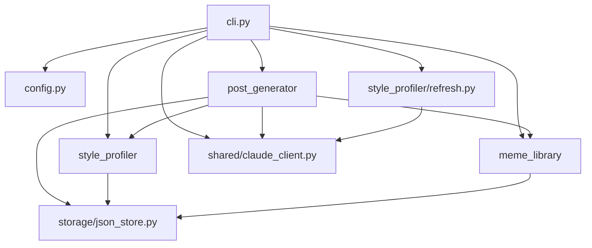

# Profile Refresh Implementation Plan

> **For agentic workers:** REQUIRED SUB-SKILL: Use superpowers:subagent-driven-development (recommended) or superpowers:executing-plans to implement this plan task-by-task. Steps use checkbox (`- [ ]`) syntax for tracking.

**Goal:** Implement `naver-bot profile-refresh` that extracts writing-style traits from local sample files via Claude and saves them as named JSON profiles, and update `naver-bot draft` to load a named profile via `--profile`.

**Architecture:** Add `profile_name` to `StyleProfile`, add `style_profiles_dir` to `Settings`, add a profile name validator and path builder to `style_profiler/service.py`, create a new `style_profiler/refresh.py` extraction service, and wire both commands in `cli.py`. All new Claude calls go through the existing `TextCompleter` protocol — no real API calls in tests.

**Tech Stack:** Python 3.11+, Pydantic v2, Typer, pytest, uv. Tests run with `uv run pytest`.

---

## Scope Check

Single subsystem: named local style profiles. All six changes (model, config, service helpers, extraction service, CLI profile-refresh, CLI draft) are tightly coupled — one plan.

---

## File Structure

- Modify: `src/naver_blog_bot/style_profiler/models.py` — add `profile_name` field
- Modify: `src/naver_blog_bot/config.py` — add `style_profiles_dir`, update `ensure_local_directories()`
- Modify: `src/naver_blog_bot/style_profiler/service.py` — add `validate_profile_name()`, `style_profile_path()`
- Create: `src/naver_blog_bot/style_profiler/refresh.py` — Claude extraction service
- Modify: `src/naver_blog_bot/cli.py` — implement `profile-refresh`, update `draft` with `--profile`
- Modify: `tests/unit/test_style_and_memes.py` — add model + path + validation tests
- Create: `tests/unit/test_profile_refresh.py` — extraction service tests
- Modify: `tests/unit/test_cli.py` — add profile-refresh and draft --profile tests
- Modify: `docs/ai-context/architecture.md` — update graph, data flow, ADR
- Modify: `docs/ai-context/domain-glossary.md` — add new terms

---

### Task 1: StyleProfile Model and Config

**Files:**
- Modify: `src/naver_blog_bot/style_profiler/models.py`
- Modify: `src/naver_blog_bot/config.py`
- Modify: `tests/unit/test_style_and_memes.py`
- Modify: `tests/unit/test_config.py`

- [ ] **Step 1: Write failing tests**

Add to `tests/unit/test_style_and_memes.py`:

```python
def test_style_profile_default_profile_name() -> None:
    profile = StyleProfile(blog_url="https://blog.naver.com/flowerbend")
    assert profile.profile_name == "default"


def test_style_profile_explicit_profile_name() -> None:
    profile = StyleProfile(
        blog_url="https://blog.naver.com/flowerbend", profile_name="food-review"
    )
    assert profile.profile_name == "food-review"
```

Add to `tests/unit/test_config.py`:

```python
def test_settings_has_style_profiles_dir(tmp_path: Path) -> None:
    import os
    os.environ["NAVER_BOT_CONFIG_DIR"] = str(tmp_path / "config")
    from naver_blog_bot.config import Settings
    settings = Settings()
    assert settings.style_profiles_dir == tmp_path / "config" / "style_profiles"
    del os.environ["NAVER_BOT_CONFIG_DIR"]


def test_ensure_local_directories_creates_style_profiles_dir(
    monkeypatch, tmp_path: Path
) -> None:
    monkeypatch.setenv("NAVER_BOT_CONFIG_DIR", str(tmp_path / "config"))
    monkeypatch.setenv("NAVER_BOT_DRAFTS_DIR", str(tmp_path / "drafts"))
    monkeypatch.setenv("NAVER_BOT_MEMES_DIR", str(tmp_path / "assets" / "memes"))
    monkeypatch.setenv(
        "NAVER_BOT_BROWSER_PROFILE_DIR", str(tmp_path / "browser-profile")
    )
    from naver_blog_bot.config import Settings, ensure_local_directories
    settings = Settings()
    ensure_local_directories(settings)
    assert (tmp_path / "config" / "style_profiles").is_dir()
```

- [ ] **Step 2: Run tests to verify they fail**

```bash
uv run pytest tests/unit/test_style_and_memes.py::test_style_profile_default_profile_name tests/unit/test_style_and_memes.py::test_style_profile_explicit_profile_name tests/unit/test_config.py::test_settings_has_style_profiles_dir tests/unit/test_config.py::test_ensure_local_directories_creates_style_profiles_dir -v
```

Expected: FAIL — `StyleProfile` has no `profile_name`, `Settings` has no `style_profiles_dir`.

- [ ] **Step 3: Add `profile_name` to StyleProfile**

In `src/naver_blog_bot/style_profiler/models.py`, replace the full file content with:

```python
import json
from datetime import datetime, timezone

from pydantic import BaseModel, Field


class StyleProfile(BaseModel):
    blog_url: str
    profile_name: str = "default"
    updated_at: datetime = Field(default_factory=lambda: datetime.now(timezone.utc))
    structure_patterns: list[str] = Field(default_factory=list)
    tone_keywords: list[str] = Field(default_factory=list)
    frequent_expressions: list[str] = Field(default_factory=list)
    review_conventions: list[str] = Field(default_factory=list)
    photo_usage_notes: list[str] = Field(default_factory=list)

    def to_cache_text(self) -> str:
        return json.dumps(
            self.model_dump(mode="json"), ensure_ascii=False, indent=2, sort_keys=True
        )
```

- [ ] **Step 4: Add `style_profiles_dir` to Settings and update `ensure_local_directories`**

In `src/naver_blog_bot/config.py`, replace the full file content with:

```python
from pathlib import Path

from pydantic import Field
from pydantic_settings import BaseSettings, SettingsConfigDict

PROJECT_ROOT = Path(__file__).resolve().parents[2]


class Settings(BaseSettings):
    model_config = SettingsConfigDict(
        env_prefix="NAVER_BOT_",
        env_file=".env",
        env_file_encoding="utf-8",
        extra="ignore",
    )

    blog_url: str = "https://blog.naver.com/flowerbend"
    ogq_artwork_id: str = "644e042a7d7f8"
    ogq_name: str = "세루리안"
    config_dir: Path = Field(default_factory=lambda: PROJECT_ROOT / "config")
    drafts_dir: Path = Field(default_factory=lambda: PROJECT_ROOT / "drafts")
    memes_dir: Path = Field(default_factory=lambda: PROJECT_ROOT / "assets" / "memes")
    browser_profile_dir: Path = Field(
        default_factory=lambda: PROJECT_ROOT / "browser-profile"
    )
    claude_model: str = "claude-opus-4-7"
    claude_max_tokens: int = 4000

    @property
    def style_profiles_dir(self) -> Path:
        return self.config_dir / "style_profiles"

    @property
    def style_profile_path(self) -> Path:
        return self.config_dir / "style_profile.json"

    @property
    def meme_index_path(self) -> Path:
        return self.config_dir / "meme_index.json"


def get_settings() -> Settings:
    return Settings()


def ensure_local_directories(settings: Settings) -> list[Path]:
    paths = [
        settings.config_dir,
        settings.style_profiles_dir,
        settings.drafts_dir,
        settings.memes_dir,
        settings.browser_profile_dir,
    ]
    for path in paths:
        path.mkdir(parents=True, exist_ok=True)
    return paths
```

- [ ] **Step 5: Run tests to verify they pass**

```bash
uv run pytest tests/unit/test_style_and_memes.py::test_style_profile_default_profile_name tests/unit/test_style_and_memes.py::test_style_profile_explicit_profile_name tests/unit/test_config.py::test_settings_has_style_profiles_dir tests/unit/test_config.py::test_ensure_local_directories_creates_style_profiles_dir -v
```

Expected: 4 passed.

- [ ] **Step 6: Run full suite to confirm no regressions**

```bash
uv run pytest -v
```

Expected: all existing tests pass (count may differ by new tests added).

- [ ] **Step 7: Commit**

```bash
git -C "//wsl.localhost/Ubuntu-24.04/home/indietogo/.config/superpowers/worktrees/naver-blog-bot/profile-refresh" add src/naver_blog_bot/style_profiler/models.py src/naver_blog_bot/config.py tests/unit/test_style_and_memes.py tests/unit/test_config.py
git -C "//wsl.localhost/Ubuntu-24.04/home/indietogo/.config/superpowers/worktrees/naver-blog-bot/profile-refresh" commit -m "$(cat <<'EOF'
Add profile_name to StyleProfile and style_profiles_dir to Settings

Named profiles need an identity field and a dedicated storage directory
separate from the legacy single-profile path.

Co-Authored-By: Claude Sonnet 4.6 <noreply@anthropic.com>
EOF
)"
```

---

### Task 2: Profile Name Validation and Path Builder

**Files:**
- Modify: `src/naver_blog_bot/style_profiler/service.py`
- Modify: `tests/unit/test_style_and_memes.py`

- [ ] **Step 1: Write failing tests**

Add to `tests/unit/test_style_and_memes.py`:

```python
from naver_blog_bot.style_profiler.service import (
    load_style_profile,
    save_style_profile,
    style_profile_path,
    validate_profile_name,
)


def test_validate_profile_name_accepts_valid_names() -> None:
    for name in ("default", "food-review", "product_review", "travel2026", "a", "z" * 64):
        validate_profile_name(name)  # must not raise


def test_validate_profile_name_rejects_invalid_names() -> None:
    import pytest
    for name in ("", "Food Review", "맛집", "../secret", ".env", "food/review", "a" * 65):
        with pytest.raises(ValueError):
            validate_profile_name(name)


def test_style_profile_path_builds_correct_path(monkeypatch, tmp_path: Path) -> None:
    monkeypatch.setenv("NAVER_BOT_CONFIG_DIR", str(tmp_path / "config"))
    monkeypatch.setenv("NAVER_BOT_DRAFTS_DIR", str(tmp_path / "drafts"))
    monkeypatch.setenv("NAVER_BOT_MEMES_DIR", str(tmp_path / "assets" / "memes"))
    monkeypatch.setenv(
        "NAVER_BOT_BROWSER_PROFILE_DIR", str(tmp_path / "browser-profile")
    )
    from naver_blog_bot.config import Settings
    settings = Settings()
    path = style_profile_path(settings, "food-review")
    assert path == tmp_path / "config" / "style_profiles" / "food-review.json"


def test_style_profile_path_rejects_invalid_name(monkeypatch, tmp_path: Path) -> None:
    import pytest
    monkeypatch.setenv("NAVER_BOT_CONFIG_DIR", str(tmp_path / "config"))
    monkeypatch.setenv("NAVER_BOT_DRAFTS_DIR", str(tmp_path / "drafts"))
    monkeypatch.setenv("NAVER_BOT_MEMES_DIR", str(tmp_path / "assets" / "memes"))
    monkeypatch.setenv(
        "NAVER_BOT_BROWSER_PROFILE_DIR", str(tmp_path / "browser-profile")
    )
    from naver_blog_bot.config import Settings
    settings = Settings()
    with pytest.raises(ValueError):
        style_profile_path(settings, "../secret")
```

- [ ] **Step 2: Run tests to verify they fail**

```bash
uv run pytest tests/unit/test_style_and_memes.py::test_validate_profile_name_accepts_valid_names tests/unit/test_style_and_memes.py::test_validate_profile_name_rejects_invalid_names tests/unit/test_style_and_memes.py::test_style_profile_path_builds_correct_path tests/unit/test_style_and_memes.py::test_style_profile_path_rejects_invalid_name -v
```

Expected: FAIL — `validate_profile_name` and `style_profile_path` not yet defined.

- [ ] **Step 3: Add `validate_profile_name` and `style_profile_path` to service.py**

Replace `src/naver_blog_bot/style_profiler/service.py` with:

```python
import re
from pathlib import Path

from naver_blog_bot.config import Settings
from naver_blog_bot.storage.json_store import read_json, write_json
from naver_blog_bot.style_profiler.models import StyleProfile

_SLUG_RE = re.compile(r"^[a-z0-9_-]{1,64}$")


def validate_profile_name(name: str) -> None:
    if not _SLUG_RE.match(name):
        raise ValueError(
            f"Invalid profile name: {name!r}. "
            "Use only lowercase letters, digits, hyphens, and underscores (1-64 chars)."
        )


def style_profile_path(settings: Settings, profile_name: str) -> Path:
    validate_profile_name(profile_name)
    return settings.style_profiles_dir / f"{profile_name}.json"


def load_style_profile(path: Path, blog_url: str) -> StyleProfile:
    if not path.exists():
        return StyleProfile(blog_url=blog_url)
    return StyleProfile.model_validate(read_json(path))


def save_style_profile(path: Path, profile: StyleProfile) -> None:
    write_json(path, profile.model_dump(mode="json"))
```

- [ ] **Step 4: Run tests to verify they pass**

```bash
uv run pytest tests/unit/test_style_and_memes.py::test_validate_profile_name_accepts_valid_names tests/unit/test_style_and_memes.py::test_validate_profile_name_rejects_invalid_names tests/unit/test_style_and_memes.py::test_style_profile_path_builds_correct_path tests/unit/test_style_and_memes.py::test_style_profile_path_rejects_invalid_name -v
```

Expected: 4 passed.

- [ ] **Step 5: Run full suite**

```bash
uv run pytest -v
```

Expected: all tests pass.

- [ ] **Step 6: Commit**

```bash
git -C "//wsl.localhost/Ubuntu-24.04/home/indietogo/.config/superpowers/worktrees/naver-blog-bot/profile-refresh" add src/naver_blog_bot/style_profiler/service.py tests/unit/test_style_and_memes.py
git -C "//wsl.localhost/Ubuntu-24.04/home/indietogo/.config/superpowers/worktrees/naver-blog-bot/profile-refresh" commit -m "$(cat <<'EOF'
Add profile name validation and named profile path builder

Strict slug validation prevents path traversal and filesystem edge cases.
style_profile_path() centralizes path construction for named profiles.

Co-Authored-By: Claude Sonnet 4.6 <noreply@anthropic.com>
EOF
)"
```

---

### Task 3: Style Refresh Extraction Service

**Files:**
- Create: `src/naver_blog_bot/style_profiler/refresh.py`
- Create: `tests/unit/test_profile_refresh.py`

- [ ] **Step 1: Write failing tests**

Create `tests/unit/test_profile_refresh.py`:

```python
import json
import pytest
from collections.abc import Sequence

from naver_blog_bot.style_profiler.models import StyleProfile
from naver_blog_bot.style_profiler.refresh import refresh_style_profile


class FakeCompleter:
    def __init__(self, response: str) -> None:
        self._response = response

    def complete_text(
        self,
        *,
        system_prompt: str,
        user_prompt: str,
        cacheable_context: Sequence[str] = (),
    ) -> str:
        return self._response


VALID_RESPONSE = json.dumps({
    "structure_patterns": ["도입부에 개인 경험을 먼저 쓴다"],
    "tone_keywords": ["다정함", "솔직함"],
    "frequent_expressions": ["완전 만족"],
    "review_conventions": ["첫인상 후 사용 경험 순"],
    "photo_usage_notes": ["사진 아래 짧은 감탄사"],
})


def test_refresh_returns_style_profile_with_profile_name() -> None:
    completer = FakeCompleter(VALID_RESPONSE)
    profile = refresh_style_profile(
        profile_name="food-review",
        blog_url="https://blog.naver.com/flowerbend",
        sample_texts=["샘플 포스트 텍스트"],
        completer=completer,
    )
    assert isinstance(profile, StyleProfile)
    assert profile.profile_name == "food-review"
    assert profile.blog_url == "https://blog.naver.com/flowerbend"
    assert "다정함" in profile.tone_keywords


def test_refresh_sets_all_fields() -> None:
    completer = FakeCompleter(VALID_RESPONSE)
    profile = refresh_style_profile(
        profile_name="default",
        blog_url="https://blog.naver.com/test",
        sample_texts=["포스트 1", "포스트 2"],
        completer=completer,
    )
    assert profile.structure_patterns == ["도입부에 개인 경험을 먼저 쓴다"]
    assert profile.frequent_expressions == ["완전 만족"]
    assert profile.review_conventions == ["첫인상 후 사용 경험 순"]
    assert profile.photo_usage_notes == ["사진 아래 짧은 감탄사"]


def test_refresh_raises_on_invalid_json() -> None:
    completer = FakeCompleter("이것은 JSON이 아닙니다")
    with pytest.raises(ValueError, match="invalid JSON"):
        refresh_style_profile(
            profile_name="default",
            blog_url="https://blog.naver.com/flowerbend",
            sample_texts=["포스트"],
            completer=completer,
        )


def test_refresh_raises_on_schema_invalid_json() -> None:
    bad_response = json.dumps({"structure_patterns": 42})
    completer = FakeCompleter(bad_response)
    with pytest.raises(ValueError, match="invalid style profile"):
        refresh_style_profile(
            profile_name="default",
            blog_url="https://blog.naver.com/flowerbend",
            sample_texts=["포스트"],
            completer=completer,
        )
```

- [ ] **Step 2: Run tests to verify they fail**

```bash
uv run pytest tests/unit/test_profile_refresh.py -v
```

Expected: FAIL — `refresh.py` does not exist.

- [ ] **Step 3: Create `src/naver_blog_bot/style_profiler/refresh.py`**

```python
import json
from collections.abc import Sequence
from typing import Protocol

from naver_blog_bot.style_profiler.models import StyleProfile

SYSTEM_PROMPT = """너는 한국어 블로그 포스트의 문체 분석가다.
제공된 샘플 포스트에서 재사용 가능한 안정적인 문체 특성을 추출해라.
포스트 내용을 요약하지 말고, 같은 문체로 다시 쓸 때 도움이 되는 반복 패턴에 집중해라.

다음 필드를 가진 JSON 객체만 반환해라:
{
  "structure_patterns": [...],
  "tone_keywords": [...],
  "frequent_expressions": [...],
  "review_conventions": [...],
  "photo_usage_notes": [...]
}

각 리스트는 3-8개의 간결한 한국어 문자열을 포함해야 한다. JSON 외의 다른 텍스트는 반환하지 마라."""


class TextCompleter(Protocol):
    def complete_text(
        self,
        *,
        system_prompt: str,
        user_prompt: str,
        cacheable_context: Sequence[str],
    ) -> str: ...


def refresh_style_profile(
    *,
    profile_name: str,
    blog_url: str,
    sample_texts: Sequence[str],
    completer: TextCompleter,
) -> StyleProfile:
    user_prompt = "샘플 블로그 포스트:\n\n" + "\n\n---\n\n".join(sample_texts)
    response = completer.complete_text(
        system_prompt=SYSTEM_PROMPT,
        user_prompt=user_prompt,
        cacheable_context=(),
    )
    try:
        data = json.loads(response)
    except json.JSONDecodeError as exc:
        raise ValueError("Claude returned invalid JSON") from exc
    try:
        return StyleProfile(profile_name=profile_name, blog_url=blog_url, **data)
    except Exception as exc:
        raise ValueError("Claude returned an invalid style profile") from exc
```

- [ ] **Step 4: Run tests to verify they pass**

```bash
uv run pytest tests/unit/test_profile_refresh.py -v
```

Expected: 4 passed.

- [ ] **Step 5: Run full suite**

```bash
uv run pytest -v
```

Expected: all tests pass.

- [ ] **Step 6: Commit**

```bash
git -C "//wsl.localhost/Ubuntu-24.04/home/indietogo/.config/superpowers/worktrees/naver-blog-bot/profile-refresh" add src/naver_blog_bot/style_profiler/refresh.py tests/unit/test_profile_refresh.py
git -C "//wsl.localhost/Ubuntu-24.04/home/indietogo/.config/superpowers/worktrees/naver-blog-bot/profile-refresh" commit -m "$(cat <<'EOF'
Add Claude-backed style profile extraction service

Accepts sample texts and a TextCompleter, returns a validated StyleProfile.
Injectable completer keeps unit tests offline.

Co-Authored-By: Claude Sonnet 4.6 <noreply@anthropic.com>
EOF
)"
```

---

### Task 4: CLI `profile-refresh` Command

**Files:**
- Modify: `src/naver_blog_bot/cli.py`
- Modify: `tests/unit/test_cli.py`

- [ ] **Step 1: Write failing tests**

Add to `tests/unit/test_cli.py`:

```python
from naver_blog_bot.style_profiler.models import StyleProfile
from naver_blog_bot.style_profiler.service import style_profile_path


class FakeRefreshService:
    """Replaces refresh_style_profile in cli module for testing."""
    def __init__(self, profile: StyleProfile) -> None:
        self._profile = profile

    def __call__(self, *, profile_name, blog_url, sample_texts, completer):
        return StyleProfile(
            profile_name=profile_name,
            blog_url=blog_url,
            tone_keywords=["테스트"],
        )


def test_profile_refresh_writes_named_profile(monkeypatch, tmp_path: Path) -> None:
    configure_paths(monkeypatch, tmp_path)
    sample = tmp_path / "post.md"
    sample.write_text("샘플 포스트 내용", encoding="utf-8")
    monkeypatch.setattr(cli, "refresh_style_profile", FakeRefreshService(None))

    result = runner.invoke(cli.app, ["profile-refresh", str(sample)])

    assert result.exit_code == 0
    assert "default.json" in result.stdout
    profile_file = tmp_path / "config" / "style_profiles" / "default.json"
    assert profile_file.exists()


def test_profile_refresh_with_explicit_profile_name(monkeypatch, tmp_path: Path) -> None:
    configure_paths(monkeypatch, tmp_path)
    sample = tmp_path / "post.md"
    sample.write_text("샘플", encoding="utf-8")
    monkeypatch.setattr(cli, "refresh_style_profile", FakeRefreshService(None))

    result = runner.invoke(cli.app, ["profile-refresh", "--profile", "food-review", str(sample)])

    assert result.exit_code == 0
    assert "food-review.json" in result.stdout
    assert (tmp_path / "config" / "style_profiles" / "food-review.json").exists()


def test_profile_refresh_rejects_invalid_profile_name(monkeypatch, tmp_path: Path) -> None:
    configure_paths(monkeypatch, tmp_path)

    result = runner.invoke(cli.app, ["profile-refresh", "--profile", "Invalid Name", "any.md"])

    assert result.exit_code == 1
    assert "Invalid profile name" in result.stdout


def test_profile_refresh_rejects_missing_sample_file(monkeypatch, tmp_path: Path) -> None:
    configure_paths(monkeypatch, tmp_path)

    result = runner.invoke(cli.app, ["profile-refresh", str(tmp_path / "missing.md")])

    assert result.exit_code == 1
    assert "sample file not found" in result.stdout


def test_profile_refresh_rejects_no_sample_files(monkeypatch, tmp_path: Path) -> None:
    configure_paths(monkeypatch, tmp_path)

    result = runner.invoke(cli.app, ["profile-refresh"])

    assert result.exit_code != 0
```

- [ ] **Step 2: Run tests to verify they fail**

```bash
uv run pytest tests/unit/test_cli.py::test_profile_refresh_writes_named_profile tests/unit/test_cli.py::test_profile_refresh_with_explicit_profile_name tests/unit/test_cli.py::test_profile_refresh_rejects_invalid_profile_name tests/unit/test_cli.py::test_profile_refresh_rejects_missing_sample_file tests/unit/test_cli.py::test_profile_refresh_rejects_no_sample_files -v
```

Expected: FAIL — `profile_refresh_command` still returns exit 1 with "outside this foundation slice".

- [ ] **Step 3: Implement `profile-refresh` in cli.py**

Replace the current `profile_refresh_command` stub and add the necessary imports. The full updated `cli.py`:

```python
from pathlib import Path
from typing import Annotated

import typer

from naver_blog_bot.config import Settings, ensure_local_directories, get_settings
from naver_blog_bot.meme_library.service import load_meme_index
from naver_blog_bot.post_generator.drafts import DraftRepository
from naver_blog_bot.post_generator.generator import PostGenerator
from naver_blog_bot.shared.claude_client import ClaudeTextClient
from naver_blog_bot.style_profiler.refresh import refresh_style_profile
from naver_blog_bot.style_profiler.service import (
    load_style_profile,
    save_style_profile,
    style_profile_path,
    validate_profile_name,
)

app = typer.Typer(no_args_is_help=True)


def build_generator(settings: Settings) -> PostGenerator:
    return PostGenerator(
        settings=settings, claude_client=ClaudeTextClient(settings=settings)
    )


@app.command("init")
def init_command() -> None:
    settings = get_settings()
    created = ensure_local_directories(settings)
    typer.echo("Local project state is ready:")
    for path in created:
        typer.echo(f"- {path}")
    typer.echo("Naver browser login automation is outside this foundation slice.")


@app.command("profile-refresh")
def profile_refresh_command(
    sample_files: Annotated[
        list[Path],
        typer.Argument(help="One or more local sample post files."),
    ],
    profile: Annotated[
        str,
        typer.Option("--profile", help="Style profile name. Default: 'default'."),
    ] = "default",
) -> None:
    settings = get_settings()
    ensure_local_directories(settings)

    try:
        validate_profile_name(profile)
    except ValueError as exc:
        typer.echo(f"Error: {exc}")
        raise typer.Exit(1)

    if not sample_files:
        typer.echo("Error: provide at least one sample post file")
        raise typer.Exit(1)

    for path in sample_files:
        if not path.is_file():
            typer.echo(f"Error: sample file not found: {path}")
            raise typer.Exit(1)

    sample_texts = [path.read_text(encoding="utf-8") for path in sample_files]

    try:
        result = refresh_style_profile(
            profile_name=profile,
            blog_url=settings.blog_url,
            sample_texts=sample_texts,
            completer=ClaudeTextClient(settings=settings),
        )
    except ValueError as exc:
        typer.echo(f"Error: {exc}")
        raise typer.Exit(1)

    save_path = style_profile_path(settings, profile)
    save_style_profile(save_path, result)
    typer.echo(
        f"Style profile saved: {save_path} ({len(sample_files)} sample(s) used)"
    )


@app.command("draft")
def draft_command(
    items: Annotated[
        list[str],
        typer.Argument(
            help="One or more photo paths followed by the memo as the final argument."
        ),
    ],
) -> None:
    if len(items) < 2:
        typer.echo("Error: provide at least one photo path and a memo")
        raise typer.Exit(1)

    settings = get_settings()
    ensure_local_directories(settings)
    photo_paths = [Path(item) for item in items[:-1]]
    memo = items[-1]
    missing = [path for path in photo_paths if not path.exists()]
    if missing:
        typer.echo(f"Error: photo not found: {missing[0]}")
        raise typer.Exit(1)

    style_profile = load_style_profile(settings.style_profile_path, settings.blog_url)
    meme_index = load_meme_index(settings.meme_index_path)
    draft = build_generator(settings).generate(
        photo_paths=photo_paths,
        memo=memo,
        style_profile=style_profile,
        meme_index=meme_index,
    )
    DraftRepository(settings.drafts_dir).save(draft)
    typer.echo(f"Draft saved: {draft.id}")


@app.command("preview")
def preview_command(
    draft_id: Annotated[str, typer.Argument(help="Draft ID to preview.")],
) -> None:
    settings = get_settings()
    try:
        draft = DraftRepository(settings.drafts_dir).load(draft_id)
    except FileNotFoundError:
        typer.echo(f"Draft not found: {draft_id}")
        raise typer.Exit(1)
    typer.echo(draft.preview_text())


@app.command("meme-build")
def meme_build_command() -> None:
    typer.echo("meme-build is outside this foundation slice.")
    raise typer.Exit(1)


@app.command("publish")
def publish_command(
    draft_id: Annotated[str, typer.Argument(help="Draft ID to publish.")],
) -> None:
    typer.echo("publish is outside this foundation slice.")
    raise typer.Exit(1)


def main() -> None:
    app()
```

- [ ] **Step 4: Run tests to verify they pass**

```bash
uv run pytest tests/unit/test_cli.py::test_profile_refresh_writes_named_profile tests/unit/test_cli.py::test_profile_refresh_with_explicit_profile_name tests/unit/test_cli.py::test_profile_refresh_rejects_invalid_profile_name tests/unit/test_cli.py::test_profile_refresh_rejects_missing_sample_file tests/unit/test_cli.py::test_profile_refresh_rejects_no_sample_files -v
```

Expected: 5 passed.

- [ ] **Step 5: Run full suite**

```bash
uv run pytest -v
```

Expected: all tests pass.

- [ ] **Step 6: Commit**

```bash
git -C "//wsl.localhost/Ubuntu-24.04/home/indietogo/.config/superpowers/worktrees/naver-blog-bot/profile-refresh" add src/naver_blog_bot/cli.py tests/unit/test_cli.py
git -C "//wsl.localhost/Ubuntu-24.04/home/indietogo/.config/superpowers/worktrees/naver-blog-bot/profile-refresh" commit -m "$(cat <<'EOF'
Implement profile-refresh CLI command

Accept local sample files, call extraction service, save named JSON profile.
Validates profile name slug and each file path before calling Claude.

Co-Authored-By: Claude Sonnet 4.6 <noreply@anthropic.com>
EOF
)"
```

---

### Task 5: Update `draft` Command with `--profile` Option

**Files:**
- Modify: `src/naver_blog_bot/cli.py`
- Modify: `tests/unit/test_cli.py`

- [ ] **Step 1: Write failing tests**

Add to `tests/unit/test_cli.py`:

```python
def test_draft_uses_default_profile_when_omitted(monkeypatch, tmp_path: Path) -> None:
    configure_paths(monkeypatch, tmp_path)
    photo = tmp_path / "photo.jpg"
    photo.write_bytes(b"fake image bytes")
    monkeypatch.setattr(cli, "build_generator", lambda settings: FakeGenerator())

    # Write a named default profile so the command can load it
    from naver_blog_bot.config import Settings, ensure_local_directories
    from naver_blog_bot.style_profiler.models import StyleProfile
    from naver_blog_bot.style_profiler.service import save_style_profile, style_profile_path
    settings = Settings()
    ensure_local_directories(settings)
    save_style_profile(
        style_profile_path(settings, "default"),
        StyleProfile(blog_url=settings.blog_url, profile_name="default"),
    )

    result = runner.invoke(cli.app, ["draft", str(photo), "메모"])

    assert result.exit_code == 0
    assert "Draft saved" in result.stdout


def test_draft_loads_explicit_named_profile(monkeypatch, tmp_path: Path) -> None:
    configure_paths(monkeypatch, tmp_path)
    photo = tmp_path / "photo.jpg"
    photo.write_bytes(b"fake image bytes")
    monkeypatch.setattr(cli, "build_generator", lambda settings: FakeGenerator())

    from naver_blog_bot.config import Settings, ensure_local_directories
    from naver_blog_bot.style_profiler.models import StyleProfile
    from naver_blog_bot.style_profiler.service import save_style_profile, style_profile_path
    settings = Settings()
    ensure_local_directories(settings)
    save_style_profile(
        style_profile_path(settings, "food-review"),
        StyleProfile(blog_url=settings.blog_url, profile_name="food-review"),
    )

    result = runner.invoke(cli.app, ["draft", "--profile", "food-review", str(photo), "메모"])

    assert result.exit_code == 0
    assert "Draft saved" in result.stdout


def test_draft_exits_when_named_profile_missing(monkeypatch, tmp_path: Path) -> None:
    configure_paths(monkeypatch, tmp_path)
    photo = tmp_path / "photo.jpg"
    photo.write_bytes(b"fake image bytes")
    monkeypatch.setattr(cli, "build_generator", lambda settings: FakeGenerator())

    result = runner.invoke(cli.app, ["draft", "--profile", "food-review", str(photo), "메모"])

    assert result.exit_code == 1
    assert "profile-refresh --profile food-review" in result.stdout


def test_draft_rejects_invalid_profile_name(monkeypatch, tmp_path: Path) -> None:
    configure_paths(monkeypatch, tmp_path)
    photo = tmp_path / "photo.jpg"
    photo.write_bytes(b"fake image bytes")

    result = runner.invoke(cli.app, ["draft", "--profile", "Invalid!", str(photo), "메모"])

    assert result.exit_code == 1
    assert "Invalid profile name" in result.stdout
```

- [ ] **Step 2: Run tests to verify they fail**

```bash
uv run pytest tests/unit/test_cli.py::test_draft_uses_default_profile_when_omitted tests/unit/test_cli.py::test_draft_loads_explicit_named_profile tests/unit/test_cli.py::test_draft_exits_when_named_profile_missing tests/unit/test_cli.py::test_draft_rejects_invalid_profile_name -v
```

Expected: FAIL — `draft` command has no `--profile` option yet.

- [ ] **Step 3: Update `draft_command` in cli.py**

Replace the `draft_command` function in `src/naver_blog_bot/cli.py` with:

```python
@app.command("draft")
def draft_command(
    items: Annotated[
        list[str],
        typer.Argument(
            help="One or more photo paths followed by the memo as the final argument."
        ),
    ],
    profile: Annotated[
        str,
        typer.Option("--profile", help="Style profile name. Default: 'default'."),
    ] = "default",
) -> None:
    if len(items) < 2:
        typer.echo("Error: provide at least one photo path and a memo")
        raise typer.Exit(1)

    settings = get_settings()
    ensure_local_directories(settings)
    photo_paths = [Path(item) for item in items[:-1]]
    memo = items[-1]
    missing = [path for path in photo_paths if not path.exists()]
    if missing:
        typer.echo(f"Error: photo not found: {missing[0]}")
        raise typer.Exit(1)

    try:
        validate_profile_name(profile)
    except ValueError as exc:
        typer.echo(f"Error: {exc}")
        raise typer.Exit(1)

    named_path = style_profile_path(settings, profile)
    if not named_path.exists():
        typer.echo(
            f"Style profile not found: {profile}. "
            f"Run profile-refresh --profile {profile} first."
        )
        raise typer.Exit(1)

    style_profile = load_style_profile(named_path, settings.blog_url)
    meme_index = load_meme_index(settings.meme_index_path)
    draft = build_generator(settings).generate(
        photo_paths=photo_paths,
        memo=memo,
        style_profile=style_profile,
        meme_index=meme_index,
    )
    DraftRepository(settings.drafts_dir).save(draft)
    typer.echo(f"Draft saved: {draft.id}")
```

- [ ] **Step 4: Run new tests to verify they pass**

```bash
uv run pytest tests/unit/test_cli.py::test_draft_uses_default_profile_when_omitted tests/unit/test_cli.py::test_draft_loads_explicit_named_profile tests/unit/test_cli.py::test_draft_exits_when_named_profile_missing tests/unit/test_cli.py::test_draft_rejects_invalid_profile_name -v
```

Expected: 4 passed.

- [ ] **Step 5: Check existing draft tests still pass**

```bash
uv run pytest tests/unit/test_cli.py -v
```

Note: `test_draft_saves_generated_draft`, `test_draft_requires_photo_and_memo`, `test_draft_rejects_missing_photo` may now fail because `draft` requires a profile file. Update `test_draft_saves_generated_draft` and `test_draft_rejects_missing_photo` to write the default profile before invoking:

```python
def test_draft_saves_generated_draft(monkeypatch, tmp_path: Path) -> None:
    configure_paths(monkeypatch, tmp_path)
    photo = tmp_path / "photo.jpg"
    photo.write_bytes(b"fake image bytes")
    monkeypatch.setattr(cli, "build_generator", lambda settings: FakeGenerator())

    from naver_blog_bot.config import Settings, ensure_local_directories
    from naver_blog_bot.style_profiler.models import StyleProfile
    from naver_blog_bot.style_profiler.service import save_style_profile, style_profile_path
    settings = Settings()
    ensure_local_directories(settings)
    save_style_profile(
        style_profile_path(settings, "default"),
        StyleProfile(blog_url=settings.blog_url),
    )

    result = runner.invoke(cli.app, ["draft", str(photo), "제품이 만족스러웠음"])

    assert result.exit_code == 0
    assert "Draft saved: draft-20260503-120000" in result.stdout
    loaded = DraftRepository(tmp_path / "drafts").load("draft-20260503-120000")
    assert loaded.memo == "제품이 만족스러웠음"
    assert loaded.photo_paths == [photo]


def test_draft_rejects_missing_photo(monkeypatch, tmp_path: Path) -> None:
    configure_paths(monkeypatch, tmp_path)

    from naver_blog_bot.config import Settings, ensure_local_directories
    from naver_blog_bot.style_profiler.models import StyleProfile
    from naver_blog_bot.style_profiler.service import save_style_profile, style_profile_path
    settings = Settings()
    ensure_local_directories(settings)
    save_style_profile(
        style_profile_path(settings, "default"),
        StyleProfile(blog_url=settings.blog_url),
    )

    result = runner.invoke(cli.app, ["draft", str(tmp_path / "missing.jpg"), "메모"])

    assert result.exit_code != 0
    assert "photo not found" in result.stdout
```

- [ ] **Step 6: Run full suite**

```bash
uv run pytest -v
```

Expected: all tests pass.

- [ ] **Step 7: Commit**

```bash
git -C "//wsl.localhost/Ubuntu-24.04/home/indietogo/.config/superpowers/worktrees/naver-blog-bot/profile-refresh" add src/naver_blog_bot/cli.py tests/unit/test_cli.py
git -C "//wsl.localhost/Ubuntu-24.04/home/indietogo/.config/superpowers/worktrees/naver-blog-bot/profile-refresh" commit -m "$(cat <<'EOF'
Add --profile option to draft command

Load named style profile from style_profiles/<name>.json.
Exits with a profile-refresh hint when the named profile is missing.

Co-Authored-By: Claude Sonnet 4.6 <noreply@anthropic.com>
EOF
)"
```

---

### Task 6: Documentation Updates

**Files:**
- Modify: `docs/ai-context/architecture.md`
- Modify: `docs/ai-context/domain-glossary.md`

- [ ] **Step 1: Update architecture module graph**

In `docs/ai-context/architecture.md`, replace the mermaid block under `## Module Dependency Graph (live)` with:



- [ ] **Step 2: Update data flow step 2 and add profile-refresh flow**

In `docs/ai-context/architecture.md`, after the existing data flow list (after step 8), add:

```markdown
### profile-refresh data flow

1. User runs `naver-bot profile-refresh [--profile <name>] <sample-file...>`.
2. `cli.py` loads `Settings`, ensures `config/style_profiles/` exists, validates profile name.
3. Each sample file is read as UTF-8 text.
4. `style_profiler/refresh.py` sends sample texts to Claude via `shared/claude_client.py`.
5. Claude returns a JSON object; `refresh.py` validates and constructs `StyleProfile`.
6. `style_profiler/service.py` writes `config/style_profiles/<profile-name>.json`.
```

- [ ] **Step 3: Add ADR for named profiles**

Append to `docs/ai-context/architecture.md`:

```markdown
### ADR-002: Named local style profiles replace single-file profile

- 날짜: 2026-05-05
- 상태: Accepted
- 결정: Style profiles are stored as `config/style_profiles/<name>.json` instead of a single `config/style_profile.json`. The `draft` command accepts `--profile <name>` (default: `default`).
- 이유: Multiple writing categories (food review, product review, travel) each need distinct style guidance; a single file cannot represent them simultaneously.
- 대안: Single file with an array of profiles; use blog categories as filenames.
- 트레이드오프: Existing `config/style_profile.json` is no longer read; users must run `profile-refresh` once to create a named profile.
```

- [ ] **Step 4: Update domain glossary**

In `docs/ai-context/domain-glossary.md`, update the `스타일 프로필` entry and add new terms. Append or update the relevant section:

```markdown
| 스타일 프로필 / style_profile | `StyleProfile` (Pydantic model). Named JSON file at `config/style_profiles/<profile-name>.json`. Stores extracted writing style traits for use in draft generation. |
| 프로필 이름 / profile_name | Safe slug (lowercase ASCII, digits, hyphens, underscores, 1-64 chars) used as the filename for a named style profile. Default value: `default`. |
| profile-refresh / profile_refresh_command | CLI command `naver-bot profile-refresh [--profile <name>] <file...>`. Reads local sample posts, calls Claude, and saves a `StyleProfile` JSON. |
```

- [ ] **Step 5: Verify documentation references**

```bash
python3 - <<'PY'
from pathlib import Path
checks = {
    'docs/ai-context/architecture.md': [
        'style_profiler/refresh.py',
        'config/style_profiles/',
        'ADR-002',
    ],
    'docs/ai-context/domain-glossary.md': [
        'profile_name',
        'profile-refresh',
    ],
}
for path, needles in checks.items():
    text = Path(path).read_text(encoding='utf-8')
    missing = [n for n in needles if n not in text]
    if missing:
        raise SystemExit(f'{path} missing {missing}')
print('docs verified')
PY
```

Run from the worktree root:

```bash
cd "//wsl.localhost/Ubuntu-24.04/home/indietogo/.config/superpowers/worktrees/naver-blog-bot/profile-refresh" && python3 - <<'PY'
...
PY
```

Expected: `docs verified`.

- [ ] **Step 6: Run full suite one final time**

```bash
uv run pytest -v
uv run naver-bot --help
```

Expected: all tests pass; `profile-refresh` listed in help output.

- [ ] **Step 7: Commit documentation**

```bash
git -C "//wsl.localhost/Ubuntu-24.04/home/indietogo/.config/superpowers/worktrees/naver-blog-bot/profile-refresh" add docs/ai-context/architecture.md docs/ai-context/domain-glossary.md
git -C "//wsl.localhost/Ubuntu-24.04/home/indietogo/.config/superpowers/worktrees/naver-blog-bot/profile-refresh" commit -m "$(cat <<'EOF'
Update architecture and glossary for named style profiles

Add refresh.py to module graph, document profile-refresh data flow,
record ADR-002 for named profile storage decision, and add glossary terms.

Co-Authored-By: Claude Sonnet 4.6 <noreply@anthropic.com>
EOF
)"
```

---

## Self-Review

**Spec coverage:**
- §2 Scope: named profile storage ✅, `profile-refresh` command ✅, `draft --profile` ✅, offline tests ✅
- §3 User workflow: all three examples covered in Task 4/5 ✅
- §4 Profile naming rules: `validate_profile_name` in Task 2 ✅
- §5 Data model: `profile_name: str` added in Task 1 ✅
- §6 Storage design: `style_profiles_dir`, `style_profile_path()`, `ensure_local_directories()` in Task 1/2 ✅
- §7 Claude extraction service: `refresh.py` in Task 3 ✅
- §8 CLI behavior `profile-refresh`: Task 4 ✅
- §8 CLI behavior `draft`: Task 5 ✅
- §9 Tests: all test scenarios covered across Task 1-5 ✅
- §10 Documentation: Task 6 ✅

**Placeholder scan:** No TBD, TODO, or "similar to" references found.

**Type consistency:**
- `validate_profile_name(name: str) -> None` — used in service.py, cli.py ✅
- `style_profile_path(settings: Settings, profile_name: str) -> Path` — consistent across service.py and cli.py ✅
- `refresh_style_profile(*, profile_name, blog_url, sample_texts, completer)` — matches test FakeCompleter interface ✅
- `StyleProfile.profile_name: str = "default"` — used in all construction sites ✅
- `TextCompleter` protocol in refresh.py matches `ClaudeTextClient.complete_text()` signature ✅
