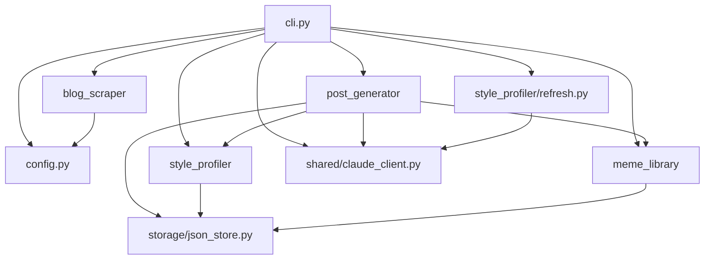

# Blog Scraper Implementation Plan

> **For agentic workers:** REQUIRED SUB-SKILL: Use superpowers:subagent-driven-development (recommended) or superpowers:executing-plans to implement this plan task-by-task. Steps use checkbox (`- [ ]`) syntax for tracking.

**Goal:** Extend `naver-bot profile-refresh` so local files and public blog URLs can be learned together while preserving text/image/emoticon rhythm.

**Architecture:** Add a focused `blog_scraper` package that returns `PostDocument` objects with ordered text/image/emoticon blocks. Platform adapters parse loaded HTML into blocks; `service.py` owns URL routing and Playwright lifecycle; `cli.py` converts scraped documents into the existing style refresh pipeline. Style extraction and draft generation are extended so learned emoticon placement becomes `{{이모티콘:감정유형}}` markers in generated drafts.

**Tech Stack:** Python 3.11+, uv, Typer, Playwright async API, pydantic, pytest, pytest-asyncio, ruff, stdlib `html.parser` for deterministic fixture-tested HTML extraction.

---

## File Structure

Create:
- `src/naver_blog_bot/blog_scraper/__init__.py` — package exports for scraper models.
- `src/naver_blog_bot/blog_scraper/models.py` — `PostDocument`, `TextBlock`, `ImageBlock`, `EmoticonBlock` and marker conversion.
- `src/naver_blog_bot/blog_scraper/service.py` — platform detection, blog/post routing, Playwright persistent context lifecycle, polite delay.
- `src/naver_blog_bot/blog_scraper/adapters/__init__.py` — adapter package marker.
- `src/naver_blog_bot/blog_scraper/adapters/html.py` — small selector helper using stdlib HTML parsing for offline fixtures.
- `src/naver_blog_bot/blog_scraper/adapters/naver.py` — Naver mobile URL normalisation, post-list URL extraction, SmartEditor block parsing.
- `src/naver_blog_bot/blog_scraper/adapters/tistory.py` — Tistory content selector parsing and blog-list extraction.
- `src/naver_blog_bot/blog_scraper/adapters/generic.py` — generic public HTML fallback parser.
- `tests/unit/test_blog_scraper_models.py` — model marker tests.
- `tests/unit/test_blog_scraper_naver.py` — Naver fixture parsing tests.
- `tests/unit/test_blog_scraper_tistory.py` — Tistory fixture parsing tests.
- `tests/unit/test_blog_scraper_generic.py` — generic fallback fixture tests.
- `tests/unit/test_blog_scraper_service.py` — routing, shared page, delay tests.

Modify:
- `pyproject.toml` and `uv.lock` — add Playwright runtime dependency and pytest-asyncio dev dependency.
- `src/naver_blog_bot/style_profiler/models.py` — add `emoticon_usage_patterns`.
- `src/naver_blog_bot/style_profiler/refresh.py` — teach Claude extraction prompt about `[이미지]` and `[이모티콘]` markers.
- `src/naver_blog_bot/post_generator/generator.py` — include learned emoticon patterns and output marker convention in draft prompt.
- `src/naver_blog_bot/cli.py` — accept URL sources and `--count`, call scraper, keep local-file behavior.
- `tests/unit/test_style_and_memes.py` — style profile field round-trip/default tests.
- `tests/unit/test_profile_refresh.py` — refresh prompt/schema tests.
- `tests/unit/test_post_generator.py` — draft prompt emoticon marker tests.
- `tests/unit/test_cli.py` — `profile-refresh` URL/mixed/count/failure tests.
- `docs/ai-context/architecture.md` — update live graph/data flow and append ADR-003.
- `docs/ai-context/domain-glossary.md` — add `PostDocument`, `이모티콘 마커`, and update style profile description.

---

### Task 1: PostDocument Block Model

**Files:**
- Create: `src/naver_blog_bot/blog_scraper/__init__.py`
- Create: `src/naver_blog_bot/blog_scraper/models.py`
- Test: `tests/unit/test_blog_scraper_models.py`

- [ ] **Step 1: Write failing model tests**

Create `tests/unit/test_blog_scraper_models.py`:

```python
from naver_blog_bot.blog_scraper.models import (
    EmoticonBlock,
    ImageBlock,
    PostDocument,
    TextBlock,
)


def test_structured_text_preserves_title_and_block_order() -> None:
    document = PostDocument(
        url="https://m.blog.naver.com/myid/223456789",
        title="포포몬 첫 사용 후기",
        blocks=[
            TextBlock(content="오늘 드디어 써봤는데요."),
            ImageBlock(alt="제품 사진"),
            TextBlock(content="첫인상은 생각보다 훨씬 좋았어요!"),
            EmoticonBlock(description="만족하는 표정"),
            ImageBlock(),
            ImageBlock(),
            EmoticonBlock(description="엄지척"),
        ],
    )

    assert document.to_structured_text() == "\n".join([
        "제목: 포포몬 첫 사용 후기",
        "",
        "오늘 드디어 써봤는데요.",
        "[이미지]",
        "첫인상은 생각보다 훨씬 좋았어요!",
        "[이모티콘:만족하는 표정]",
        "[이미지]",
        "[이미지]",
        "[이모티콘:엄지척]",
    ])


def test_structured_text_skips_empty_text_blocks() -> None:
    document = PostDocument(
        url="https://example.com/post",
        blocks=[
            TextBlock(content="  "),
            TextBlock(content="본문"),
            EmoticonBlock(),
        ],
    )

    assert document.to_structured_text() == "본문\n[이모티콘]"


def test_structured_text_without_title_has_no_leading_blank_line() -> None:
    document = PostDocument(
        url="https://example.com/post",
        blocks=[ImageBlock(), TextBlock(content="마무리")],
    )

    assert document.to_structured_text() == "[이미지]\n마무리"
```

- [ ] **Step 2: Run model tests and confirm failure**

Run:

```bash
uv run pytest tests/unit/test_blog_scraper_models.py -q
```

Expected: FAIL with `ModuleNotFoundError: No module named 'naver_blog_bot.blog_scraper'`.

- [ ] **Step 3: Implement scraper package and models**

Create `src/naver_blog_bot/blog_scraper/__init__.py`:

```python
from naver_blog_bot.blog_scraper.models import (
    EmoticonBlock,
    ImageBlock,
    PostBlock,
    PostDocument,
    TextBlock,
)

__all__ = [
    "EmoticonBlock",
    "ImageBlock",
    "PostBlock",
    "PostDocument",
    "TextBlock",
]
```

Create `src/naver_blog_bot/blog_scraper/models.py`:

```python
from typing import Literal

from pydantic import BaseModel


class TextBlock(BaseModel):
    type: Literal["text"] = "text"
    content: str


class ImageBlock(BaseModel):
    type: Literal["image"] = "image"
    alt: str = ""


class EmoticonBlock(BaseModel):
    type: Literal["emoticon"] = "emoticon"
    description: str = ""


PostBlock = TextBlock | ImageBlock | EmoticonBlock


class PostDocument(BaseModel):
    url: str
    title: str = ""
    blocks: list[PostBlock]

    def to_structured_text(self) -> str:
        lines: list[str] = []
        if self.title:
            lines += [f"제목: {self.title}", ""]
        for block in self.blocks:
            if block.type == "text":
                stripped = block.content.strip()
                if stripped:
                    lines.append(stripped)
            elif block.type == "image":
                lines.append("[이미지]")
            elif block.type == "emoticon":
                description = f":{block.description}" if block.description else ""
                lines.append(f"[이모티콘{description}]")
        return "\n".join(lines)
```

- [ ] **Step 4: Run model tests and confirm pass**

Run:

```bash
uv run pytest tests/unit/test_blog_scraper_models.py -q
```

Expected: `3 passed`.

- [ ] **Step 5: Commit Task 1**

```bash
git add src/naver_blog_bot/blog_scraper/__init__.py src/naver_blog_bot/blog_scraper/models.py tests/unit/test_blog_scraper_models.py
git commit -m "feat: add blog scraper block model"
```

---

### Task 2: HTML Parsing Helper and Naver Adapter

**Files:**
- Create: `src/naver_blog_bot/blog_scraper/adapters/__init__.py`
- Create: `src/naver_blog_bot/blog_scraper/adapters/html.py`
- Create: `src/naver_blog_bot/blog_scraper/adapters/naver.py`
- Test: `tests/unit/test_blog_scraper_naver.py`

- [ ] **Step 1: Write failing Naver adapter fixture tests**

Create `tests/unit/test_blog_scraper_naver.py`:

```python
from naver_blog_bot.blog_scraper.adapters.naver import (
    collect_post_urls,
    is_blog_url,
    is_emoticon_img_attrs,
    normalize_naver_url,
    parse_post_html,
    post_list_url,
)
from naver_blog_bot.blog_scraper.models import EmoticonBlock, ImageBlock, TextBlock


NAVER_SMARTEDITOR_HTML = """
<html>
<head><title>포포몬 첫 사용 후기 : 네이버 블로그</title></head>
<body>
  <div class="se-main-container">
    <div class="se-component se-text"><p>오늘 드디어 써봤는데요.</p></div>
    <div class="se-component se-image"></div>
    <div class="se-component se-text"><p>첫인상은 생각보다 훨씬 좋았어요!</p></div>
    <div class="se-component se-sticker"></div>
    <div class="se-component se-image"></div>
  </div>
</body>
</html>
"""


NAVER_LEGACY_HTML = """
<html>
<head><title>예전 글 : 네이버 블로그</title></head>
<body>
  <div id="postViewArea">
    <p>레거시 본문입니다.</p>
    
    
  </div>
</body>
</html>
"""


POST_LIST_HTML = """
<html><body>
  <a href="/myid/223456789">첫 번째 글</a>
  <a href="https://m.blog.naver.com/myid/223456790">두 번째 글</a>
  <a href="/PostView.naver?blogId=myid&logNo=223456791">세 번째 글</a>
  <a href="/myid/category">카테고리</a>
</body></html>
"""


def test_normalize_naver_url_converts_pc_to_mobile() -> None:
    assert normalize_naver_url("https://blog.naver.com/myid") == "https://m.blog.naver.com/myid"
    assert normalize_naver_url("https://blog.naver.com/myid/223456789") == "https://m.blog.naver.com/myid/223456789"
    assert normalize_naver_url("https://m.blog.naver.com/myid/223456789") == "https://m.blog.naver.com/myid/223456789"


def test_is_blog_url_distinguishes_blog_index_from_post() -> None:
    assert is_blog_url("https://blog.naver.com/myid") is True
    assert is_blog_url("https://m.blog.naver.com/myid") is True
    assert is_blog_url("https://blog.naver.com/myid/223456789") is False
    assert is_blog_url("https://m.blog.naver.com/PostView.naver?blogId=myid&logNo=223456789") is False


def test_post_list_url_builds_mobile_post_list_url() -> None:
    assert post_list_url("https://blog.naver.com/myid") == "https://m.blog.naver.com/PostList.naver?blogId=myid&currentPage=1"


def test_parse_smarteditor_blocks_in_document_order() -> None:
    document = parse_post_html(NAVER_SMARTEDITOR_HTML, "https://m.blog.naver.com/myid/223456789")

    assert document.title == "포포몬 첫 사용 후기"
    assert [type(block) for block in document.blocks] == [
        TextBlock,
        ImageBlock,
        TextBlock,
        EmoticonBlock,
        ImageBlock,
    ]
    assert document.blocks[0].content == "오늘 드디어 써봤는데요."
    assert document.blocks[1].alt == "제품 사진"
    assert document.blocks[3].description == "만족하는 표정"


def test_parse_legacy_post_view_area_fallback() -> None:
    document = parse_post_html(NAVER_LEGACY_HTML, "https://m.blog.naver.com/myid/1")

    assert document.title == "예전 글"
    assert [type(block) for block in document.blocks] == [TextBlock, ImageBlock, EmoticonBlock]
    assert document.blocks[0].content == "레거시 본문입니다."
    assert document.blocks[2].description == "웃는 표정"


def test_emoticon_detection_uses_url_patterns_and_css_keywords() -> None:
    assert is_emoticon_img_attrs("https://storep-phinf.pstatic.net/ogq/me/sticker.png", "") is True
    assert is_emoticon_img_attrs("https://example.com/static/se/sticker/1.png", "") is True
    assert is_emoticon_img_attrs("https://example.com/image.png", "se-emoticon-image") is True
    assert is_emoticon_img_attrs("https://postfiles.pstatic.net/photo.jpg", "se-image") is False


def test_collect_post_urls_from_mobile_post_list() -> None:
    urls = collect_post_urls(
        POST_LIST_HTML,
        "https://m.blog.naver.com/PostList.naver?blogId=myid&currentPage=1",
        count=2,
    )

    assert urls == [
        "https://m.blog.naver.com/myid/223456789",
        "https://m.blog.naver.com/myid/223456790",
    ]
```

- [ ] **Step 2: Run Naver adapter tests and confirm failure**

Run:

```bash
uv run pytest tests/unit/test_blog_scraper_naver.py -q
```

Expected: FAIL with `ModuleNotFoundError: No module named 'naver_blog_bot.blog_scraper.adapters'`.

- [ ] **Step 3: Implement adapter package marker and HTML helper**

Create `src/naver_blog_bot/blog_scraper/adapters/__init__.py`:

```python
__all__: list[str] = []
```

Create `src/naver_blog_bot/blog_scraper/adapters/html.py`:

```python
from __future__ import annotations

from dataclasses import dataclass, field
from html.parser import HTMLParser

VOID_TAGS = {
    "area",
    "base",
    "br",
    "col",
    "embed",
    "hr",
    "img",
    "input",
    "link",
    "meta",
    "param",
    "source",
    "track",
    "wbr",
}


@dataclass
class HtmlNode:
    tag: str
    attrs: dict[str, str] = field(default_factory=dict)
    children: list[HtmlNode | str] = field(default_factory=list)

    def class_names(self) -> set[str]:
        return set(self.attrs.get("class", "").split())

    def text_content(self) -> str:
        parts: list[str] = []
        for child in self.children:
            if isinstance(child, str):
                parts.append(child)
            else:
                parts.append(child.text_content())
        return normalize_text(" ".join(parts))


class _HtmlTreeParser(HTMLParser):
    def __init__(self) -> None:
        super().__init__(convert_charrefs=True)
        self.root = HtmlNode("document")
        self.stack = [self.root]

    def handle_starttag(self, tag: str, attrs: list[tuple[str, str | None]]) -> None:
        node = HtmlNode(tag.lower(), {key: value or "" for key, value in attrs})
        self.stack[-1].children.append(node)
        if node.tag not in VOID_TAGS:
            self.stack.append(node)

    def handle_startendtag(self, tag: str, attrs: list[tuple[str, str | None]]) -> None:
        node = HtmlNode(tag.lower(), {key: value or "" for key, value in attrs})
        self.stack[-1].children.append(node)

    def handle_endtag(self, tag: str) -> None:
        tag = tag.lower()
        while len(self.stack) > 1:
            node = self.stack.pop()
            if node.tag == tag:
                break

    def handle_data(self, data: str) -> None:
        if data.strip():
            self.stack[-1].children.append(data)


def parse_html(html: str) -> HtmlNode:
    parser = _HtmlTreeParser()
    parser.feed(html)
    return parser.root


def normalize_text(text: str) -> str:
    return " ".join(text.split())


def element_children(node: HtmlNode) -> list[HtmlNode]:
    return [child for child in node.children if isinstance(child, HtmlNode)]


def iter_descendants(node: HtmlNode) -> list[HtmlNode]:
    result: list[HtmlNode] = []
    for child in element_children(node):
        result.append(child)
        result.extend(iter_descendants(child))
    return result


def matches_selector(node: HtmlNode, selector: str) -> bool:
    if selector.startswith("#"):
        return node.attrs.get("id") == selector[1:]
    if selector.startswith("."):
        return selector[1:] in node.class_names()
    if "." in selector:
        tag, class_name = selector.split(".", 1)
        return node.tag == tag and class_name in node.class_names()
    return node.tag == selector


def select_all(node: HtmlNode, selector: str) -> list[HtmlNode]:
    return [descendant for descendant in iter_descendants(node) if matches_selector(descendant, selector)]


def select_first(node: HtmlNode, selectors: list[str]) -> HtmlNode | None:
    for selector in selectors:
        matches = select_all(node, selector)
        if matches:
            return matches[0]
    return None


def first_title(root: HtmlNode) -> str:
    title = select_first(root, ["title"])
    if title is None:
        return ""
    return title.text_content().split(":")[0].strip()
```

- [ ] **Step 4: Implement Naver adapter**

Create `src/naver_blog_bot/blog_scraper/adapters/naver.py`:

```python
import re
from urllib.parse import parse_qs, urljoin, urlparse, urlunparse

from naver_blog_bot.blog_scraper.adapters.html import (
    HtmlNode,
    element_children,
    first_title,
    parse_html,
    select_all,
    select_first,
)
from naver_blog_bot.blog_scraper.models import (
    EmoticonBlock,
    ImageBlock,
    PostBlock,
    PostDocument,
    TextBlock,
)

EMOTICON_URL_PATTERNS = [
    "ogq.me",
    "/ogq/",
    "pstatic.net/static/se/sticker",
    "pstatic.net/static/se/emoticon",
    "static/se/sticker",
    "static/se/emoticon",
]
EMOTICON_CSS_KEYWORDS = ["emoticon", "sticker"]


def normalize_naver_url(url: str) -> str:
    parsed = urlparse(url)
    if parsed.netloc.lower() == "blog.naver.com":
        parsed = parsed._replace(netloc="m.blog.naver.com")
    return urlunparse(parsed)


def is_blog_url(url: str) -> bool:
    parsed = urlparse(normalize_naver_url(url))
    if parsed.path.endswith("/PostView.naver"):
        return False
    path_parts = [part for part in parsed.path.split("/") if part]
    return len(path_parts) <= 1


def post_list_url(url: str) -> str:
    parsed = urlparse(normalize_naver_url(url))
    path_parts = [part for part in parsed.path.split("/") if part]
    blog_id = path_parts[0] if path_parts else parse_qs(parsed.query).get("blogId", [""])[0]
    return f"https://m.blog.naver.com/PostList.naver?blogId={blog_id}&currentPage=1"


def is_emoticon_img_attrs(src: str, classes: str) -> bool:
    src_lower = src.lower()
    classes_lower = classes.lower()
    return any(pattern in src_lower for pattern in EMOTICON_URL_PATTERNS) or any(
        keyword in classes_lower for keyword in EMOTICON_CSS_KEYWORDS
    )


def _image_block_from_node(img: HtmlNode) -> ImageBlock | EmoticonBlock:
    src = img.attrs.get("src", "")
    classes = img.attrs.get("class", "")
    alt = img.attrs.get("alt", "")
    if is_emoticon_img_attrs(src, classes):
        return EmoticonBlock(description=alt)
    return ImageBlock(alt=alt)


def _blocks_from_component(component: HtmlNode) -> list[PostBlock]:
    text_node = select_first(component, [".se-text"])
    if text_node is None and component.tag == "p":
        text_node = component
    if text_node is not None:
        text = text_node.text_content()
        if text:
            return [TextBlock(content=text)]

    image_nodes = select_all(component, "img")
    if component.tag == "img":
        image_nodes = [component]
    return [_image_block_from_node(img) for img in image_nodes]


def parse_post_html(html: str, url: str) -> PostDocument:
    root = parse_html(html)
    container = select_first(root, [".se-main-container", "#postViewArea"])
    if container is None:
        raise ValueError("unsupported Naver post structure")

    components = select_all(container, ".se-component") or element_children(container)
    blocks: list[PostBlock] = []
    for component in components:
        blocks.extend(_blocks_from_component(component))

    return PostDocument(url=url, title=first_title(root), blocks=blocks)


def _post_url_from_href(href: str, base_url: str) -> str | None:
    absolute = urljoin(base_url, href)
    parsed = urlparse(absolute)
    if parsed.netloc.lower() != "m.blog.naver.com":
        return None
    if re.search(r"/[^/]+/\d+$", parsed.path):
        return absolute
    if parsed.path.endswith("/PostView.naver") and parse_qs(parsed.query).get("logNo"):
        return absolute
    return None


def collect_post_urls(html: str, base_url: str, count: int) -> list[str]:
    root = parse_html(html)
    urls: list[str] = []
    for anchor in select_all(root, "a"):
        href = anchor.attrs.get("href", "")
        post_url = _post_url_from_href(href, base_url)
        if post_url and post_url not in urls:
            urls.append(post_url)
        if len(urls) >= count:
            break
    return urls


async def scrape_post(page, url: str) -> PostDocument:
    target_url = normalize_naver_url(url)
    await page.goto(target_url, wait_until="networkidle")
    html = await page.content()
    return parse_post_html(html, target_url)


async def collect_blog_post_urls(page, url: str, count: int) -> list[str]:
    list_url = post_list_url(url)
    await page.goto(list_url, wait_until="networkidle")
    html = await page.content()
    urls = collect_post_urls(html, list_url, count)
    if not urls:
        raise ValueError(f"no posts found at {url}")
    return urls
```

- [ ] **Step 5: Run Naver adapter tests and confirm pass**

Run:

```bash
uv run pytest tests/unit/test_blog_scraper_naver.py -q
```

Expected: `7 passed`.

- [ ] **Step 6: Commit Task 2**

```bash
git add src/naver_blog_bot/blog_scraper/adapters/__init__.py src/naver_blog_bot/blog_scraper/adapters/html.py src/naver_blog_bot/blog_scraper/adapters/naver.py tests/unit/test_blog_scraper_naver.py
git commit -m "feat: add naver blog scraping adapter"
```

---

### Task 3: Tistory and Generic Adapters

**Files:**
- Create: `src/naver_blog_bot/blog_scraper/adapters/tistory.py`
- Create: `src/naver_blog_bot/blog_scraper/adapters/generic.py`
- Test: `tests/unit/test_blog_scraper_tistory.py`
- Test: `tests/unit/test_blog_scraper_generic.py`

- [ ] **Step 1: Write failing Tistory adapter tests**

Create `tests/unit/test_blog_scraper_tistory.py`:

```python
from naver_blog_bot.blog_scraper.adapters.tistory import (
    collect_post_urls,
    is_blog_url,
    parse_post_html,
)
from naver_blog_bot.blog_scraper.models import ImageBlock, TextBlock


TISTORY_POST_HTML = """
<html>
<head><title>티스토리 맛집 후기</title></head>
<body>
  <article class="entry-content">
    <p>첫 문단입니다.</p>
    <figure></figure>
    <p>두 번째 문단입니다.</p>
  </article>
</body>
</html>
"""


TISTORY_LIST_HTML = """
<html><body>
  <a href="/123">첫 글</a>
  <a href="https://myblog.tistory.com/124">둘째 글</a>
  <a href="/category/food">카테고리</a>
</body></html>
"""


def test_parse_tistory_post_uses_entry_content_selector() -> None:
    document = parse_post_html(TISTORY_POST_HTML, "https://myblog.tistory.com/123")

    assert document.title == "티스토리 맛집 후기"
    assert [type(block) for block in document.blocks] == [TextBlock, ImageBlock, TextBlock]
    assert document.blocks[0].content == "첫 문단입니다."
    assert document.blocks[1].alt == "음식 사진"
    assert document.blocks[2].content == "두 번째 문단입니다."


def test_tistory_does_not_create_emoticon_blocks() -> None:
    document = parse_post_html(
        """
        <html><body><div class="article_view">
          
        </div></body></html>
        """,
        "https://myblog.tistory.com/123",
    )

    assert [type(block) for block in document.blocks] == [ImageBlock]


def test_collect_tistory_post_urls() -> None:
    urls = collect_post_urls(TISTORY_LIST_HTML, "https://myblog.tistory.com", count=2)

    assert urls == ["https://myblog.tistory.com/123", "https://myblog.tistory.com/124"]


def test_is_tistory_blog_url_distinguishes_index_from_numeric_post() -> None:
    assert is_blog_url("https://myblog.tistory.com") is True
    assert is_blog_url("https://myblog.tistory.com/123") is False
```

- [ ] **Step 2: Write failing generic adapter tests**

Create `tests/unit/test_blog_scraper_generic.py`:

```python
from naver_blog_bot.blog_scraper.adapters.generic import parse_post_html
from naver_blog_bot.blog_scraper.models import ImageBlock, TextBlock


GENERIC_HTML = """
<html>
<head><title>일반 블로그 글</title></head>
<body>
  <main>
    <p>도입 문단입니다.</p>
    
    <p>마무리 문단입니다.</p>
  </main>
</body>
</html>
"""


def test_parse_generic_post_uses_main_selector() -> None:
    document = parse_post_html(GENERIC_HTML, "https://example.com/post")

    assert document.title == "일반 블로그 글"
    assert [type(block) for block in document.blocks] == [TextBlock, ImageBlock, TextBlock]
    assert document.blocks[0].content == "도입 문단입니다."
    assert document.blocks[1].alt == "일반 이미지"


def test_parse_generic_post_falls_back_to_body() -> None:
    document = parse_post_html(
        "<html><body><p>본문만 있는 글</p></body></html>",
        "https://example.com/post",
    )

    assert document.blocks == [TextBlock(content="본문만 있는 글")]
```

- [ ] **Step 3: Run adapter tests and confirm failure**

Run:

```bash
uv run pytest tests/unit/test_blog_scraper_tistory.py tests/unit/test_blog_scraper_generic.py -q
```

Expected: FAIL with `ModuleNotFoundError` for `adapters.tistory` and `adapters.generic`.

- [ ] **Step 4: Implement Tistory adapter**

Create `src/naver_blog_bot/blog_scraper/adapters/tistory.py`:

```python
import re
from urllib.parse import urljoin, urlparse

from naver_blog_bot.blog_scraper.adapters.html import (
    HtmlNode,
    first_title,
    iter_descendants,
    parse_html,
    select_all,
    select_first,
)
from naver_blog_bot.blog_scraper.models import ImageBlock, PostBlock, PostDocument, TextBlock

CONTENT_SELECTORS = [
    "article.entry-content",
    ".tt_article_useless_p_margin",
    ".article_view",
    "#content",
]


def is_blog_url(url: str) -> bool:
    path_parts = [part for part in urlparse(url).path.split("/") if part]
    return not (len(path_parts) == 1 and path_parts[0].isdigit())


def _blocks_from_container(container: HtmlNode) -> list[PostBlock]:
    blocks: list[PostBlock] = []
    for node in iter_descendants(container):
        if node.tag == "p":
            text = node.text_content()
            if text:
                blocks.append(TextBlock(content=text))
        elif node.tag == "img":
            blocks.append(ImageBlock(alt=node.attrs.get("alt", "")))
    return blocks


def parse_post_html(html: str, url: str) -> PostDocument:
    root = parse_html(html)
    container = select_first(root, CONTENT_SELECTORS)
    if container is None:
        raise ValueError("unsupported Tistory post structure")
    return PostDocument(url=url, title=first_title(root), blocks=_blocks_from_container(container))


def collect_post_urls(html: str, base_url: str, count: int) -> list[str]:
    root = parse_html(html)
    urls: list[str] = []
    for anchor in select_all(root, "a"):
        href = anchor.attrs.get("href", "")
        absolute = urljoin(base_url, href)
        parsed = urlparse(absolute)
        if parsed.netloc != urlparse(base_url).netloc:
            continue
        if re.fullmatch(r"/\d+", parsed.path) and absolute not in urls:
            urls.append(absolute)
        if len(urls) >= count:
            break
    return urls


async def scrape_post(page, url: str) -> PostDocument:
    await page.goto(url, wait_until="networkidle")
    html = await page.content()
    return parse_post_html(html, url)


async def collect_blog_post_urls(page, url: str, count: int) -> list[str]:
    await page.goto(url, wait_until="networkidle")
    html = await page.content()
    urls = collect_post_urls(html, url, count)
    if not urls:
        raise ValueError(f"no posts found at {url}")
    return urls
```

- [ ] **Step 5: Implement generic adapter**

Create `src/naver_blog_bot/blog_scraper/adapters/generic.py`:

```python
from naver_blog_bot.blog_scraper.adapters.html import (
    HtmlNode,
    first_title,
    iter_descendants,
    parse_html,
    select_first,
)
from naver_blog_bot.blog_scraper.models import ImageBlock, PostBlock, PostDocument, TextBlock

CONTENT_SELECTORS = ["article", "main", ".content", "#content", "body"]


def _blocks_from_container(container: HtmlNode) -> list[PostBlock]:
    blocks: list[PostBlock] = []
    for node in iter_descendants(container):
        if node.tag == "p":
            text = node.text_content()
            if text:
                blocks.append(TextBlock(content=text))
        elif node.tag == "img":
            blocks.append(ImageBlock(alt=node.attrs.get("alt", "")))
    return blocks


def parse_post_html(html: str, url: str) -> PostDocument:
    root = parse_html(html)
    container = select_first(root, CONTENT_SELECTORS)
    if container is None:
        raise ValueError("unsupported generic post structure")
    return PostDocument(url=url, title=first_title(root), blocks=_blocks_from_container(container))


def is_blog_url(url: str) -> bool:
    return False


async def scrape_post(page, url: str) -> PostDocument:
    await page.goto(url, wait_until="networkidle")
    html = await page.content()
    return parse_post_html(html, url)


async def collect_blog_post_urls(page, url: str, count: int) -> list[str]:
    return [url]
```

- [ ] **Step 6: Run adapter tests and confirm pass**

Run:

```bash
uv run pytest tests/unit/test_blog_scraper_tistory.py tests/unit/test_blog_scraper_generic.py -q
```

Expected: `6 passed`.

- [ ] **Step 7: Commit Task 3**

```bash
git add src/naver_blog_bot/blog_scraper/adapters/tistory.py src/naver_blog_bot/blog_scraper/adapters/generic.py tests/unit/test_blog_scraper_tistory.py tests/unit/test_blog_scraper_generic.py
git commit -m "feat: add tistory and generic blog adapters"
```

---

### Task 4: Scraper Service and Playwright Lifecycle

**Files:**
- Modify: `pyproject.toml`
- Modify: `uv.lock`
- Create: `src/naver_blog_bot/blog_scraper/service.py`
- Test: `tests/unit/test_blog_scraper_service.py`

- [ ] **Step 1: Add Playwright and async test dependencies**

Run:

```bash
uv add "playwright>=1.56.0" && uv add --dev "pytest-asyncio>=1.2.0"
```

Expected: `pyproject.toml` contains `"playwright>=1.56.0"` under `[project].dependencies`, contains `"pytest-asyncio>=1.2.0"` under `[dependency-groups].dev`, and `uv.lock` is updated.

- [ ] **Step 2: Write failing service tests**

Create `tests/unit/test_blog_scraper_service.py`:

```python
import pytest

from naver_blog_bot.blog_scraper import service
from naver_blog_bot.blog_scraper.models import PostDocument, TextBlock
from naver_blog_bot.config import Settings


class FakeContext:
    def __init__(self) -> None:
        self.closed = False
        self.page = object()

    async def new_page(self):
        return self.page

    async def close(self) -> None:
        self.closed = True


class FakeChromium:
    def __init__(self) -> None:
        self.persistent_context = FakeContext()
        self.regular_context = FakeContext()
        self.persistent_user_data_dir = None
        self.launched_regular = False

    async def launch_persistent_context(self, user_data_dir, headless=True):
        self.persistent_user_data_dir = user_data_dir
        return self.persistent_context

    async def launch(self, headless=True):
        self.launched_regular = True
        return self

    async def new_context(self):
        return self.regular_context


class FakePlaywright:
    def __init__(self) -> None:
        self.chromium = FakeChromium()


@pytest.mark.parametrize(
    ("url", "expected"),
    [
        ("https://blog.naver.com/myid", "naver"),
        ("https://m.blog.naver.com/myid/223456789", "naver"),
        ("https://myblog.tistory.com/123", "tistory"),
        ("https://example.com/post", "generic"),
    ],
)
def test_detect_platform(url: str, expected: str) -> None:
    assert service.detect_platform(url) == expected


@pytest.mark.asyncio
async def test_async_scrape_routes_blog_url_to_collected_posts(monkeypatch, tmp_path) -> None:
    settings = Settings(browser_profile_dir=tmp_path / "browser-profile")
    playwright = FakePlaywright()
    calls: list[str] = []
    sleeps: list[int] = []

    async def fake_collect(page, url, count):
        assert count == 2
        return ["https://m.blog.naver.com/myid/1", "https://m.blog.naver.com/myid/2"]

    async def fake_scrape_post(page, url):
        calls.append(url)
        return PostDocument(url=url, blocks=[TextBlock(content=url.rsplit("/", 1)[-1])])

    async def fake_sleep(seconds):
        sleeps.append(seconds)

    monkeypatch.setattr(service.naver, "collect_blog_post_urls", fake_collect)
    monkeypatch.setattr(service.naver, "scrape_post", fake_scrape_post)
    monkeypatch.setattr(service.asyncio, "sleep", fake_sleep)

    documents = await service._scrape("https://blog.naver.com/myid", 2, settings, playwright)

    assert [document.to_structured_text() for document in documents] == ["1", "2"]
    assert calls == ["https://m.blog.naver.com/myid/1", "https://m.blog.naver.com/myid/2"]
    assert sleeps == [1]
    assert playwright.chromium.persistent_user_data_dir == settings.browser_profile_dir
    assert playwright.chromium.persistent_context.closed is True


@pytest.mark.asyncio
async def test_async_scrape_routes_single_post_directly(monkeypatch, tmp_path) -> None:
    settings = Settings(browser_profile_dir=tmp_path / "browser-profile")
    playwright = FakePlaywright()
    calls: list[str] = []

    async def fake_scrape_post(page, url):
        calls.append(url)
        return PostDocument(url=url, blocks=[TextBlock(content="single")])

    monkeypatch.setattr(service.naver, "scrape_post", fake_scrape_post)

    documents = await service._scrape("https://blog.naver.com/myid/223456789", 5, settings, playwright)

    assert [document.to_structured_text() for document in documents] == ["single"]
    assert calls == ["https://blog.naver.com/myid/223456789"]


@pytest.mark.asyncio
async def test_async_scrape_uses_regular_context_for_non_naver(monkeypatch, tmp_path) -> None:
    settings = Settings(browser_profile_dir=tmp_path / "browser-profile")
    playwright = FakePlaywright()

    async def fake_scrape_post(page, url):
        return PostDocument(url=url, blocks=[TextBlock(content="generic")])

    monkeypatch.setattr(service.generic, "scrape_post", fake_scrape_post)

    documents = await service._scrape("https://example.com/post", 5, settings, playwright)

    assert documents[0].to_structured_text() == "generic"
    assert playwright.chromium.launched_regular is True
    assert playwright.chromium.regular_context.closed is True
```

- [ ] **Step 3: Run service tests and confirm failure**

Run:

```bash
uv run pytest tests/unit/test_blog_scraper_service.py -q
```

Expected: FAIL with `ImportError: cannot import name 'service'` or missing `service.py`.

- [ ] **Step 4: Implement scraper service**

Create `src/naver_blog_bot/blog_scraper/service.py`:

```python
import asyncio
from urllib.parse import urlparse

from playwright.async_api import async_playwright

from naver_blog_bot.blog_scraper.adapters import generic, naver, tistory
from naver_blog_bot.blog_scraper.models import PostDocument
from naver_blog_bot.config import Settings

PLATFORM_ADAPTERS = {
    "naver": naver,
    "tistory": tistory,
    "generic": generic,
}


def detect_platform(url: str) -> str:
    host = urlparse(url).netloc.lower()
    if "blog.naver.com" in host or "m.blog.naver.com" in host:
        return "naver"
    if host.endswith(".tistory.com"):
        return "tistory"
    return "generic"


def _is_blog_url(platform: str, url: str) -> bool:
    return PLATFORM_ADAPTERS[platform].is_blog_url(url)


async def _open_context(playwright, platform: str, settings: Settings):
    if platform == "naver":
        return await playwright.chromium.launch_persistent_context(
            settings.browser_profile_dir,
            headless=True,
        )
    browser = await playwright.chromium.launch(headless=True)
    return await browser.new_context()


async def _scrape_posts_with_delay(adapter, page, urls: list[str]) -> list[PostDocument]:
    documents: list[PostDocument] = []
    for index, post_url in enumerate(urls):
        if index > 0:
            await asyncio.sleep(1)
        documents.append(await adapter.scrape_post(page, post_url))
    return documents


async def _scrape(url: str, count: int, settings: Settings, playwright) -> list[PostDocument]:
    platform = detect_platform(url)
    adapter = PLATFORM_ADAPTERS[platform]
    context = await _open_context(playwright, platform, settings)
    try:
        page = await context.new_page()
        if _is_blog_url(platform, url):
            post_urls = await adapter.collect_blog_post_urls(page, url, count)
            return await _scrape_posts_with_delay(adapter, page, post_urls)
        return [await adapter.scrape_post(page, url)]
    finally:
        await context.close()


async def scrape_post(url: str, settings: Settings) -> PostDocument:
    async with async_playwright() as playwright:
        documents = await _scrape(url, 1, settings, playwright)
        return documents[0]


async def scrape_blog(url: str, count: int, settings: Settings) -> list[PostDocument]:
    async with async_playwright() as playwright:
        return await _scrape(url, count, settings, playwright)


def scrape(url: str, count: int, settings: Settings) -> list[PostDocument]:
    return asyncio.run(scrape_blog(url, count, settings))
```

- [ ] **Step 5: Run service tests and confirm pass**

Run:

```bash
uv run pytest tests/unit/test_blog_scraper_service.py -q
```

Expected: `7 passed`.

- [ ] **Step 6: Commit Task 4**

```bash
git add pyproject.toml uv.lock src/naver_blog_bot/blog_scraper/service.py tests/unit/test_blog_scraper_service.py
git commit -m "feat: add blog scraper service routing"
```

---

### Task 5: StyleProfile Emoticon Pattern Extraction

**Files:**
- Modify: `src/naver_blog_bot/style_profiler/models.py`
- Modify: `src/naver_blog_bot/style_profiler/refresh.py`
- Modify: `tests/unit/test_style_and_memes.py`
- Modify: `tests/unit/test_profile_refresh.py`

- [ ] **Step 1: Add failing StyleProfile tests**

Append to `tests/unit/test_style_and_memes.py`:

```python

def test_style_profile_emoticon_usage_patterns_default_empty() -> None:
    profile = StyleProfile(blog_url="https://blog.naver.com/flowerbend")

    assert profile.emoticon_usage_patterns == []


def test_style_profile_round_trip_includes_emoticon_usage_patterns(tmp_path: Path) -> None:
    profile = StyleProfile(
        blog_url="https://blog.naver.com/flowerbend",
        emoticon_usage_patterns=["이미지 뒤에 만족형 이모티콘"],
    )
    path = tmp_path / "style_profile.json"

    save_style_profile(path, profile)
    loaded = load_style_profile(path, profile.blog_url)

    assert loaded.emoticon_usage_patterns == ["이미지 뒤에 만족형 이모티콘"]
    assert "이미지 뒤에 만족형 이모티콘" in loaded.to_cache_text()
```

- [ ] **Step 2: Update profile refresh tests for new JSON field and prompt markers**

Modify `VALID_RESPONSE` in `tests/unit/test_profile_refresh.py` to include `emoticon_usage_patterns`:

```python
VALID_RESPONSE = json.dumps({
    "structure_patterns": ["도입부에 개인 경험을 먼저 쓴다"],
    "tone_keywords": ["다정함", "솔직함"],
    "frequent_expressions": ["완전 만족"],
    "review_conventions": ["첫인상 후 사용 경험 순"],
    "photo_usage_notes": ["사진 아래 짧은 감탄사"],
    "emoticon_usage_patterns": ["이미지 뒤에 만족형 이모티콘"],
})
```

Add tests to `tests/unit/test_profile_refresh.py`:

```python

def test_refresh_sets_emoticon_usage_patterns() -> None:
    completer = FakeCompleter(VALID_RESPONSE)
    profile = refresh_style_profile(
        profile_name="default",
        blog_url="https://blog.naver.com/test",
        sample_texts=["본문\n[이미지]\n[이모티콘:만족]"],
        completer=completer,
    )

    assert profile.emoticon_usage_patterns == ["이미지 뒤에 만족형 이모티콘"]


def test_refresh_prompt_mentions_structure_markers() -> None:
    completer = FakeCompleter(VALID_RESPONSE)
    refresh_style_profile(
        profile_name="default",
        blog_url="https://blog.naver.com/test",
        sample_texts=["본문\n[이미지]\n[이모티콘:만족]"],
        completer=completer,
    )

    assert "[이미지]" in completer.last_system_prompt
    assert "[이모티콘]" in completer.last_system_prompt
    assert "emoticon_usage_patterns" in completer.last_system_prompt


def test_refresh_defaults_missing_emoticon_usage_patterns() -> None:
    response = json.dumps({
        "structure_patterns": ["도입부에 개인 경험을 먼저 쓴다"],
        "tone_keywords": ["다정함", "솔직함"],
        "frequent_expressions": ["완전 만족"],
        "review_conventions": ["첫인상 후 사용 경험 순"],
        "photo_usage_notes": ["사진 아래 짧은 감탄사"],
    })
    completer = FakeCompleter(response)

    profile = refresh_style_profile(
        profile_name="default",
        blog_url="https://blog.naver.com/test",
        sample_texts=["포스트"],
        completer=completer,
    )

    assert profile.emoticon_usage_patterns == []
```

Update `FakeCompleter` in `tests/unit/test_profile_refresh.py` so the prompt test can inspect the system prompt:

```python
class FakeCompleter:
    def __init__(self, response: str) -> None:
        self._response = response
        self.last_system_prompt = ""
        self.last_user_prompt = ""

    def complete_text(
        self,
        *,
        system_prompt: str,
        user_prompt: str,
        cacheable_context: Sequence[str] = (),
    ) -> str:
        self.last_system_prompt = system_prompt
        self.last_user_prompt = user_prompt
        return self._response
```

- [ ] **Step 3: Run profile tests and confirm failure**

Run:

```bash
uv run pytest tests/unit/test_style_and_memes.py tests/unit/test_profile_refresh.py -q
```

Expected: FAIL with `AttributeError` or assertion failure for missing `emoticon_usage_patterns` and prompt text.

- [ ] **Step 4: Add StyleProfile field**

Modify `src/naver_blog_bot/style_profiler/models.py`:

```python
class StyleProfile(BaseModel):
    blog_url: str
    profile_name: str = "default"
    updated_at: datetime = Field(default_factory=lambda: datetime.now(timezone.utc))
    structure_patterns: list[str] = Field(default_factory=list)
    tone_keywords: list[str] = Field(default_factory=list)
    frequent_expressions: list[str] = Field(default_factory=list)
    review_conventions: list[str] = Field(default_factory=list)
    photo_usage_notes: list[str] = Field(default_factory=list)
    emoticon_usage_patterns: list[str] = Field(default_factory=list)
```

Keep `to_cache_text()` unchanged.

- [ ] **Step 5: Update style refresh system prompt**

Replace `SYSTEM_PROMPT` in `src/naver_blog_bot/style_profiler/refresh.py` with:

```python
SYSTEM_PROMPT = """너는 한국어 블로그 포스트의 문체 분석가다.
제공된 샘플 포스트에서 재사용 가능한 안정적인 문체 특성을 추출해라.
포스트 내용을 요약하지 말고, 같은 문체로 다시 쓸 때 도움이 되는 반복 패턴에 집중해라.

샘플 텍스트에는 구조 마커가 포함될 수 있다:
- [이미지]: 실제 이미지 삽입 위치
- [이모티콘] 또는 [이모티콘:설명]: 이모티콘/스티커 삽입 위치

다음 필드를 가진 JSON 객체만 반환해라:
{
  "structure_patterns": [...],
  "tone_keywords": [...],
  "frequent_expressions": [...],
  "review_conventions": [...],
  "photo_usage_notes": [...],
  "emoticon_usage_patterns": [...]
}

각 리스트는 3-8개의 간결한 한국어 문자열을 포함해야 한다.
"emoticon_usage_patterns"에는 이모티콘 삽입 빈도, 위치, 감정 유형의 반복 패턴을 담아라.
예: "이미지 뒤에 만족형 이모티콘", "포스트 마지막에 마무리 이모티콘 1개".
JSON 외의 다른 텍스트는 반환하지 마라."""
```

- [ ] **Step 6: Run profile tests and confirm pass**

Run:

```bash
uv run pytest tests/unit/test_style_and_memes.py tests/unit/test_profile_refresh.py -q
```

Expected: all tests in both files pass.

- [ ] **Step 7: Commit Task 5**

```bash
git add src/naver_blog_bot/style_profiler/models.py src/naver_blog_bot/style_profiler/refresh.py tests/unit/test_style_and_memes.py tests/unit/test_profile_refresh.py
git commit -m "feat: learn emoticon usage patterns"
```

---

### Task 6: Draft Prompt Emoticon Marker Convention

**Files:**
- Modify: `src/naver_blog_bot/post_generator/generator.py`
- Modify: `tests/unit/test_post_generator.py`

- [ ] **Step 1: Write failing draft prompt test**

Modify the `style_profile` in `test_post_generator_builds_draft_with_cacheable_context()` in `tests/unit/test_post_generator.py`:

```python
    style_profile = StyleProfile(
        blog_url="https://blog.naver.com/flowerbend",
        updated_at=now,
        frequent_expressions=["완전 만족"],
        review_conventions=["첫인상 다음 사용 경험"],
        emoticon_usage_patterns=["이미지 2장 뒤에 만족/감탄 계열 이모티콘"],
    )
```

Add these assertions near the existing `user_prompt` assertions:

```python
    assert "이미지 2장 뒤에 만족/감탄 계열 이모티콘" in fake.last_call["user_prompt"]
    assert "{{이모티콘:감정유형}}" in fake.last_call["user_prompt"]
```

- [ ] **Step 2: Run post generator tests and confirm failure**

Run:

```bash
uv run pytest tests/unit/test_post_generator.py -q
```

Expected: FAIL because the prompt does not include `{{이모티콘:감정유형}}` or `emoticon_usage_patterns` text yet.

- [ ] **Step 3: Pass StyleProfile into prompt builder**

Modify `src/naver_blog_bot/post_generator/generator.py` so `generate()` calls `_build_user_prompt()` with `style_profile`:

```python
            user_prompt=self._build_user_prompt(
                photo_paths, memo, selected_memes, style_profile
            ),
```

Update `_build_user_prompt()` signature:

```python
    def _build_user_prompt(
        self,
        photo_paths: list[Path],
        memo: str,
        selected_memes: list[MemeAsset],
        style_profile: StyleProfile,
    ) -> str:
```

- [ ] **Step 4: Add emoticon pattern prompt text**

Inside `_build_user_prompt()`, after `memes = ...`, add:

```python
        emoticon_patterns = (
            "\n".join(f"- {pattern}" for pattern in style_profile.emoticon_usage_patterns)
            or "- 없음"
        )
```

Then replace the returned f-string with:

```python
        return f"""다음 메모와 사진 목록을 바탕으로 네이버 블로그 초안을 작성해줘.

메모:
{memo}

사진 경로:
{photos}

사용 가능한 OGQ 이모티콘:
- artworkId: {self.settings.ogq_artwork_id}
- name: {self.settings.ogq_name}

학습된 이모티콘 사용 패턴:
{emoticon_patterns}

추천 짤방 후보:
{memes}

출력 형식:
- 첫 줄은 마크다운 H1 제목으로 작성
- 본문은 한국어 마크다운으로 작성
- 사진을 넣을 위치는 `[사진: 파일경로]` 형식으로 표시
- OGQ를 넣을 위치는 `[OGQ: {self.settings.ogq_name}]` 형식으로 표시
- 이모티콘을 넣을 위치는 `{{{{이모티콘:감정유형}}}}` 형식으로 표시
- 감정유형은 한국어로 간단히 작성한다. 예: 만족, 감탄, 응원, 마무리
- 이모티콘 위치는 학습된 패턴을 따른다
- 짤방을 넣을 위치는 `[짤방: 파일경로]` 형식으로 표시
"""
```

- [ ] **Step 5: Run post generator tests and confirm pass**

Run:

```bash
uv run pytest tests/unit/test_post_generator.py -q
```

Expected: all tests in `test_post_generator.py` pass.

- [ ] **Step 6: Commit Task 6**

```bash
git add src/naver_blog_bot/post_generator/generator.py tests/unit/test_post_generator.py
git commit -m "feat: include emoticon markers in draft prompts"
```

---

### Task 7: profile-refresh URL Sources and Count Option

**Files:**
- Modify: `src/naver_blog_bot/cli.py`
- Modify: `tests/unit/test_cli.py`

- [ ] **Step 1: Write failing CLI tests for URL sources**

Add imports near the top of `tests/unit/test_cli.py`:

```python
from naver_blog_bot.blog_scraper.models import EmoticonBlock, ImageBlock, PostDocument, TextBlock
```

Add this fake scraper class after `FakeRefreshService`:

```python
class FakeScraper:
    def __init__(self) -> None:
        self.calls: list[tuple[str, int]] = []

    def __call__(self, url, count, settings):
        self.calls.append((url, count))
        return [
            PostDocument(
                url=url,
                title="스크랩 글",
                blocks=[
                    TextBlock(content="스크랩 본문"),
                    ImageBlock(),
                    EmoticonBlock(description="만족"),
                ],
            )
        ]
```

Add tests to `tests/unit/test_cli.py`:

```python

def test_profile_refresh_accepts_url_source(monkeypatch, tmp_path: Path) -> None:
    configure_paths(monkeypatch, tmp_path)
    fake_refresh = FakeRefreshService()
    fake_scraper = FakeScraper()
    monkeypatch.setattr(cli, "refresh_style_profile", fake_refresh)
    monkeypatch.setattr(cli, "scrape", fake_scraper)

    result = runner.invoke(cli.app, ["profile-refresh", "https://blog.naver.com/myid"])

    assert result.exit_code == 0
    assert fake_scraper.calls == [("https://blog.naver.com/myid", 5)]
    assert "1 sample(s) used" in result.stdout


def test_profile_refresh_accepts_mixed_url_and_file(monkeypatch, tmp_path: Path) -> None:
    configure_paths(monkeypatch, tmp_path)
    sample = tmp_path / "post.md"
    sample.write_text("로컬 샘플", encoding="utf-8")
    fake_scraper = FakeScraper()
    captured = {}

    def fake_refresh(*, profile_name, blog_url, sample_texts, completer):
        captured["sample_texts"] = sample_texts
        return StyleProfile(profile_name=profile_name, blog_url=blog_url)

    monkeypatch.setattr(cli, "refresh_style_profile", fake_refresh)
    monkeypatch.setattr(cli, "scrape", fake_scraper)

    result = runner.invoke(
        cli.app,
        ["profile-refresh", "https://blog.naver.com/myid", str(sample)],
    )

    assert result.exit_code == 0
    assert len(captured["sample_texts"]) == 2
    assert "[이미지]" in captured["sample_texts"][0]
    assert "[이모티콘:만족]" in captured["sample_texts"][0]
    assert captured["sample_texts"][1] == "로컬 샘플"
    assert "2 sample(s) used" in result.stdout


def test_profile_refresh_passes_count_to_scraper(monkeypatch, tmp_path: Path) -> None:
    configure_paths(monkeypatch, tmp_path)
    fake_scraper = FakeScraper()
    monkeypatch.setattr(cli, "refresh_style_profile", FakeRefreshService())
    monkeypatch.setattr(cli, "scrape", fake_scraper)

    result = runner.invoke(
        cli.app,
        ["profile-refresh", "--count", "10", "https://blog.naver.com/myid"],
    )

    assert result.exit_code == 0
    assert fake_scraper.calls == [("https://blog.naver.com/myid", 10)]


def test_profile_refresh_scrape_failure_exits_one(monkeypatch, tmp_path: Path) -> None:
    configure_paths(monkeypatch, tmp_path)

    def failing_scrape(url, count, settings):
        raise RuntimeError("network down")

    monkeypatch.setattr(cli, "scrape", failing_scrape)

    result = runner.invoke(cli.app, ["profile-refresh", "https://blog.naver.com/myid"])

    assert result.exit_code == 1
    assert "failed to scrape https://blog.naver.com/myid: network down" in result.stdout


def test_profile_refresh_no_posts_found_exits_one(monkeypatch, tmp_path: Path) -> None:
    configure_paths(monkeypatch, tmp_path)
    monkeypatch.setattr(cli, "scrape", lambda url, count, settings: [])

    result = runner.invoke(cli.app, ["profile-refresh", "https://blog.naver.com/myid"])

    assert result.exit_code == 1
    assert "no posts found at https://blog.naver.com/myid" in result.stdout
```

- [ ] **Step 2: Run CLI tests and confirm failure**

Run:

```bash
uv run pytest tests/unit/test_cli.py -q
```

Expected: FAIL because `cli.scrape` is not imported and `profile-refresh` still treats URLs as file paths.

- [ ] **Step 3: Import scraper and update command signature**

In `src/naver_blog_bot/cli.py`, add:

```python
from naver_blog_bot.blog_scraper.service import scrape
```

Replace `profile_refresh_command()` signature with:

```python
@app.command("profile-refresh")
def profile_refresh_command(
    sources: Annotated[
        list[str],
        typer.Argument(help="One or more local sample post files or public blog URLs."),
    ],
    profile: Annotated[
        str,
        typer.Option("--profile", help="Style profile name. Default: 'default'."),
    ] = "default",
    count: Annotated[
        int,
        typer.Option("--count", help="Number of posts to scrape from blog-level URLs."),
    ] = 5,
) -> None:
```

Add helper near `build_generator()`:

```python
def is_url_source(source: str) -> bool:
    return source.startswith(("http://", "https://"))
```

- [ ] **Step 4: Replace source loading logic**

Replace the existing `sample_files` validation/read block in `profile_refresh_command()` with:

```python
    if not sources:
        typer.echo("Error: provide at least one sample post file or URL")
        raise typer.Exit(1)

    sample_texts: list[str] = []
    sample_count = 0
    for source in sources:
        if is_url_source(source):
            try:
                documents = scrape(source, count, settings)
            except ValueError as exc:
                message = str(exc)
                if message.startswith("no posts found at "):
                    typer.echo(f"Error: {message}")
                else:
                    typer.echo(f"Error: failed to scrape {source}: {message}")
                raise typer.Exit(1)
            except Exception as exc:
                typer.echo(f"Error: failed to scrape {source}: {exc}")
                raise typer.Exit(1)
            if not documents:
                typer.echo(f"Error: no posts found at {source}")
                raise typer.Exit(1)
            sample_texts.extend(document.to_structured_text() for document in documents)
            sample_count += len(documents)
        else:
            path = Path(source)
            if not path.is_file():
                typer.echo(f"Error: sample file not found: {path}")
                raise typer.Exit(1)
            sample_texts.append(path.read_text(encoding="utf-8"))
            sample_count += 1
```

Replace the final echo with:

```python
    typer.echo(f"Style profile saved: {save_path} ({sample_count} sample(s) used)")
```

- [ ] **Step 5: Run CLI tests and confirm pass**

Run:

```bash
uv run pytest tests/unit/test_cli.py -q
```

Expected: all tests in `test_cli.py` pass.

- [ ] **Step 6: Commit Task 7**

```bash
git add src/naver_blog_bot/cli.py tests/unit/test_cli.py
git commit -m "feat: accept blog urls in profile refresh"
```

---

### Task 8: Architecture and Glossary Updates

**Files:**
- Modify: `docs/ai-context/architecture.md`
- Modify: `docs/ai-context/domain-glossary.md`

- [ ] **Step 1: Update architecture module graph**

In `docs/ai-context/architecture.md`, update the mermaid graph to include `blog_scraper`:



- [ ] **Step 2: Update profile-refresh data flow**

Replace the `profile-refresh data flow` numbered list with:

```markdown
1. User runs `naver-bot profile-refresh [--profile <name>] [--count N] <source...>`.
2. `cli.py` loads `Settings`, ensures `config/style_profiles/` exists, validates profile name.
3. Each source is classified as URL (`http://` or `https://`) or local file path.
4. Local files are read as UTF-8 text.
5. URL sources route through `blog_scraper.service`, which detects platform, opens Playwright once per scrape call, reuses `browser_profile_dir` for Naver, and returns `PostDocument` objects.
6. Each `PostDocument` becomes structured text with `[이미지]` and `[이모티콘:설명]` markers.
7. `style_profiler/refresh.py` sends sample texts to Claude via `shared/claude_client.py`.
8. Claude returns a JSON object including `emoticon_usage_patterns`; `refresh.py` validates and constructs `StyleProfile`.
9. `style_profiler/service.py` writes `config/style_profiles/<profile-name>.json`.
```

- [ ] **Step 3: Append ADR-003 without editing older ADRs**

Append this ADR above the `<!-- ADR 형식:` comment:

```markdown
### ADR-003: Blog scraper uses mobile URL and URL-pattern emoticon detection

- 날짜: 2026-05-07
- 상태: Accepted
- 결정: Blog scraping is implemented in `blog_scraper` with platform adapters. Naver Blog scraping normalizes PC URLs to mobile URLs and detects emoticons primarily from stable URL patterns such as OGQ and SmartEditor sticker paths, with CSS class keywords only as a fallback.
- 이유: Naver PC blog pages add iframe complexity, while mobile pages expose post content more directly. SmartEditor ONE CSS class names are proprietary and may change, so URL patterns are the more stable signal for distinguishing stickers from regular images.
- 대안: Scrape PC iframe pages directly; rely on SmartEditor CSS class names only; store downloaded emoticon image files.
- 트레이드오프: The scraper preserves structural placement and emoticon intent but does not download or archive actual sticker assets in this slice.
```

- [ ] **Step 4: Update glossary rows**

In `docs/ai-context/domain-glossary.md`, replace the `스타일 프로필` row with:

```markdown
| 스타일 프로필 | `StyleProfile`, `config/style_profiles/<profile-name>.json` | 작성자 문체 신호를 담는 로컬 JSON 데이터. 이름 있는 여러 프로필과 `emoticon_usage_patterns` 지원 |
```

Add these rows under the existing `profile-refresh 명령` row:

```markdown
| 블록 문서 | `PostDocument`, `TextBlock`, `ImageBlock`, `EmoticonBlock` | 스크랩한 글의 텍스트·이미지·이모티콘 위치를 DOM 순서대로 보존하는 중간 표현 |
| 구조 텍스트 | `PostDocument.to_structured_text()` | 블록 문서를 Claude 문체 학습용 텍스트로 변환하며 `[이미지]`, `[이모티콘:설명]` 마커를 유지 |
| 이모티콘 마커 | `{{이모티콘:감정유형}}` | 초안 본문에서 미래 publish 단계가 사용 가능한 OGQ 스티커로 치환할 위치 표시 |
```

- [ ] **Step 5: Run documentation grep checks**

Run:

```bash
grep -n "blog_scraper\|ADR-003\|PostDocument\|이모티콘 마커" docs/ai-context/architecture.md docs/ai-context/domain-glossary.md
```

Expected: output includes `blog_scraper`, `ADR-003`, `PostDocument`, and `이모티콘 마커`.

- [ ] **Step 6: Commit Task 8**

```bash
git add docs/ai-context/architecture.md docs/ai-context/domain-glossary.md
git commit -m "docs: document blog scraper architecture"
```

---

### Task 9: Full Local Gate

**Files:**
- No source changes expected.

- [ ] **Step 1: Run all blog scraper unit tests**

Run:

```bash
uv run pytest tests/unit/test_blog_scraper_models.py tests/unit/test_blog_scraper_naver.py tests/unit/test_blog_scraper_tistory.py tests/unit/test_blog_scraper_generic.py tests/unit/test_blog_scraper_service.py -q
```

Expected: all blog scraper tests pass.

- [ ] **Step 2: Run style/profile/draft/CLI regression tests**

Run:

```bash
uv run pytest tests/unit/test_style_and_memes.py tests/unit/test_profile_refresh.py tests/unit/test_post_generator.py tests/unit/test_cli.py -q
```

Expected: all targeted regression tests pass.

- [ ] **Step 3: Run full project gate**

Run:

```bash
./scripts/check.sh
```

Expected:

```text
== naver-blog-bot check ==
```

Then ruff check passes, ruff format check passes, pytest passes, and output ends with:

```text
== check complete ==
```

- [ ] **Step 4: Inspect git status**

Run:

```bash
git status --short
```

Expected: no uncommitted source, test, lockfile, or documentation changes.

---

## Self-Review

**Spec coverage:**
- URL scraping for Naver/Tistory/generic: Tasks 2, 3, 4, 7.
- Browser profile reuse for Naver: Task 4 uses `launch_persistent_context(settings.browser_profile_dir)`.
- Ordered text/image/emoticon block model: Task 1.
- URL-pattern emoticon detection: Task 2.
- `profile-refresh [--count N] <url-or-file...>`: Task 7.
- `StyleProfile.emoticon_usage_patterns`: Task 5.
- SYSTEM_PROMPT marker recognition: Task 5.
- PostGenerator `{{이모티콘:감정유형}}` convention: Task 6.
- Polite 1-second delay between posts: Task 4.
- ADR and glossary updates: Task 8.

**Placeholder scan:** The plan contains no placeholder markers or vague implementation steps. All changed code steps include exact snippets or complete file contents.

**Type consistency:** `PostDocument`, `TextBlock`, `ImageBlock`, `EmoticonBlock`, `scrape(url, count, settings)`, `detect_platform(url)`, `emoticon_usage_patterns`, and `{{이모티콘:감정유형}}` are named consistently across model, adapter, service, CLI, prompt, and docs tasks.
